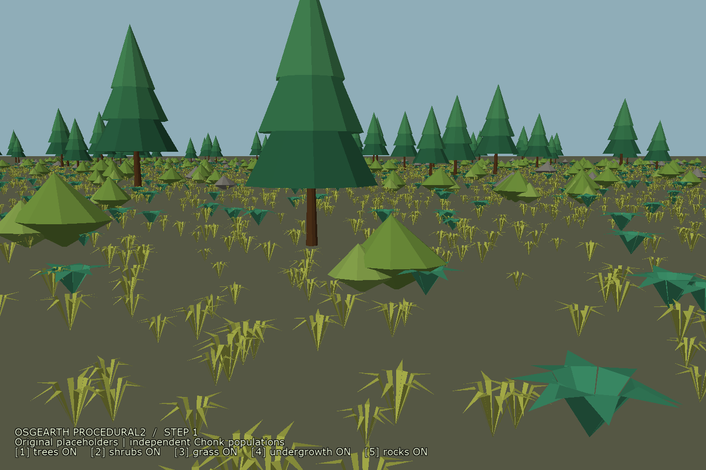
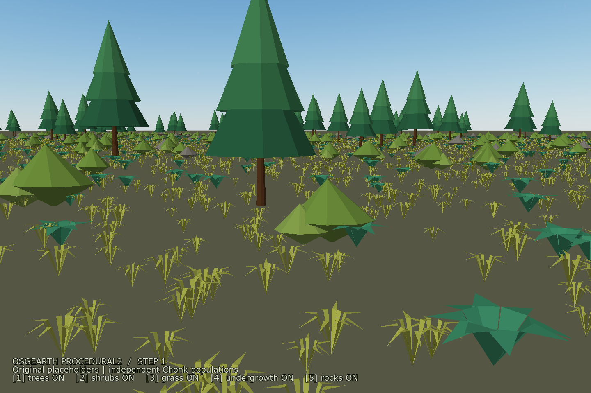
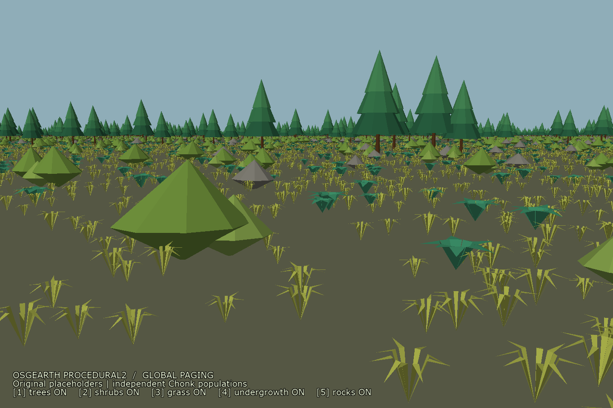
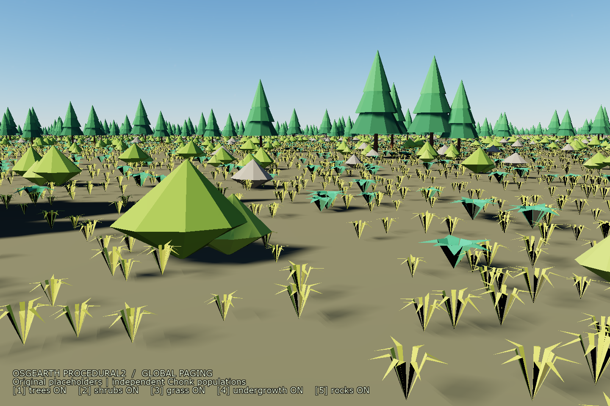
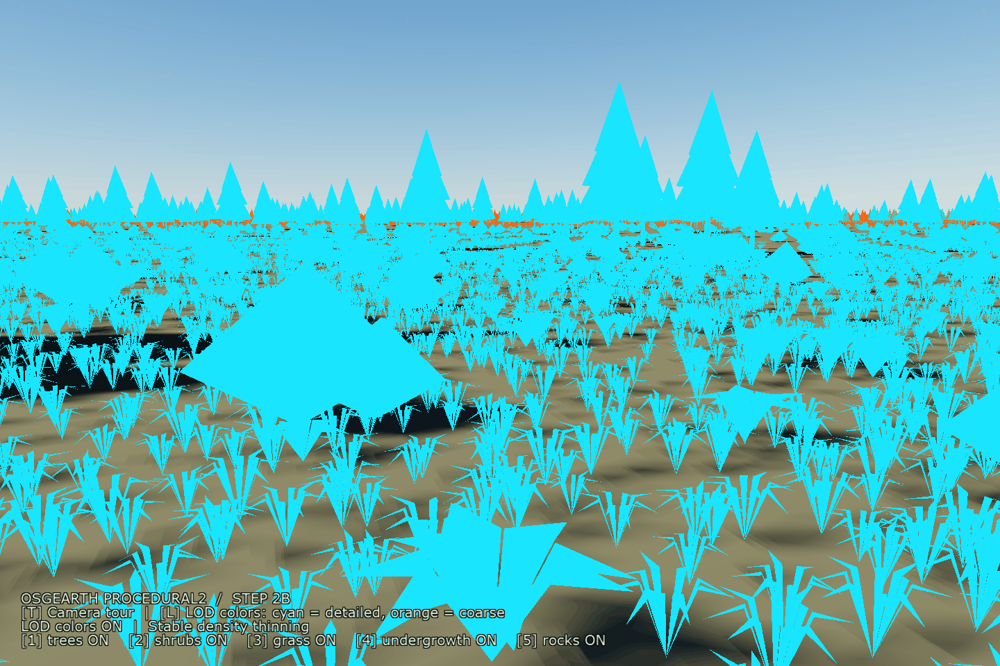
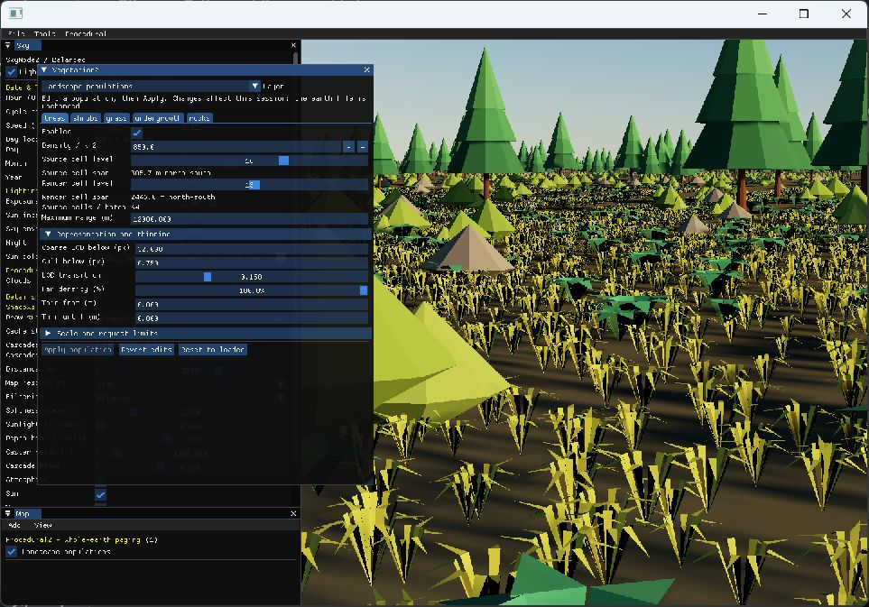

# Historical Vegetation2 development notes

Archived October 2, 2026. These experiments and intermediate settings are superseded by
[the current Master Plan](procedural2-plan.md). This file is history, not current configuration guidance.

# osgEarthProcedural2 development plan

Rendering checkpoint: **Step 4B initial forest hierarchy -- detailed trees, medium canopy, and far canopy on real OSM coverage.**
Current checkpoint: **Step 4B art detour: imported VRV trees and generated LODs in `tests/a.earth`. Step 4A editable exclusion overlays are available.**
Latest addition: **October 1: independent medium/far retention percentages in both exact clusters and coverage stands. Tree quality selects representations; maximum range controls visibility.**
Next planned checkpoint: **Step 4B optional coverage-stand comparison; exact tree clusters remain the baseline. Total resident page/upload budgets remain follow-up work.**
The main testing scene is `tests/a.earth`, with VRV trees and agricultural rows.
`tests/procedural2-canopy-osm.earth` is the portable forest example using the checked-in PBR art.
Step 2C procedural grass remains optional; adoption is still undecided.

## TODO -- after cleanup

- [ ] Add the shared, camera-independent `PlacementGenerator` for simulation queries, returning final
  terrain-clamped real placements. **Later; not started.** Resume after cleanup work.
  See [simulation placement queries](#later----simulation-placement-queries).

## Aggregate retention controls -- October 1

Step 4B remains an experiment with both exact tree clusters and coverage stands available. In **Vegetation 2 >
Trees > Canopy hierarchy**, **Medium retained (%)** and **Far retained (%)** control independent fractions of each
full tier population. Both default to 100%; try medium 75% / far 50% for comparison, then **Apply population**.
These percentages are not multiplied: 75% medium and 50% far means half the full far population, not 37.5%.
Configuration uses `canopy_mid_retention="0.75" canopy_far_retention="0.5"`; each accepts 0..1.
The existing old distance-thinning controls/keys are retired for tree populations. Grass/shrub distance thinning
remains available. Detailed tree density, quality handovers, maximum range, cluster size, and culling switches
retain their existing meanings.

Filtering uses a fixed hash of placement identity, independent of coverage-density and species hashes. In exact
mode it removes individual trees before elevation sampling and cluster packing; retained positions, species,
scale, and rotation stay unchanged. Lower percentages are nested subsets of higher percentages wherever the
underlying placement IDs match. There is no frame-dependent randomization or pixel dithering. The existing A2C
handover introduces/removes the different-density tiers. Changing retention rebuilds that population's pages;
it is intentionally not a live alpha-only control that would leave all tree records and card geometry resident.

In coverage mode, medium representative tree roots and far stand proxies/boundary tree cards use the same filter.
A far stand is removed as a whole; 50% means approximately half the proxies, not exactly half the trees depicted
inside their textures or half the visible pixels. This can expose larger gaps. Retention is a statistical percentage,
not an exact quota on every small page. No tree or stand is enlarged to compensate. Zero produces a valid empty
payload and avoids querying the source or loading assets for that tier; it does not disable that tier or extend
another tier into its range. Medium-only mode uses medium retention; disabling aggregation leaves individuals
unchanged.

This reduces packed member records, height samples, and card geometry. Exact mode still enumerates its full
placement candidates first; coverage mode still compiles its field and generates proxies before filtering.
Fewer cards do not imply a proportional frame-rate improvement. No benchmark is part of this change.

Validation: optimized RelWithDebInfo build/install and all 96 selected vegetation/Chonk tests pass
(969,052 assertions). Retention checks cover stable/nested identity, independent coverage masks, config migration,
actual exact/coverage page dispatch, independent tier fractions, untouched detailed trees and handover errors,
medium-only mode, and empty-tier refinement.

## Optional coverage-stand experiment -- October 1

The exact tree-card baseline is checkpointed and pushed on `b-vegetation2` at
`aca98e004870dd12a00c88caf0b99b638b1d852a`. Experimental work is isolated on
`codex/vegetation2-coverage-experiment`, with **both implementations selectable in the same demo**.
No branch switching is needed for visual A/B comparison, and omission of `canopy_strategy` still selects `exact`.
The main scene remains `tests/a.earth`. In Vegetation 2 > Trees > Canopy hierarchy, select **Representation**:
**Exact tree clusters** or **Coverage stands (experimental)**, then Apply. Only that population's pager rebuilds.
Quality remains live and selects handovers; maximum range still limits visibility. Both aggregate tier switches,
GPU-culling switches, and live debug colors apply in either mode.

The experiment changes how coarse pages are populated, without replacing SimplePager, OSM rule evaluation,
Chonk instancing, asset residency, compressed textures, normal/PBR shading, or A2C alpha ramps:

- **Detailed:** original placement and elevation samples, unchanged.
- **Medium:** stable representative tree roots sampled directly from the page's coverage field at the same nominal
  density. This bypasses fine-cell enumeration and specialized detailed placement; it still uses one tree impostor
  per representative. At the default 100% retention it does not reduce medium card count; the separate medium
  retention control can reduce it.
- **Far:** reusable stand impostors at their authored dimensions. The current VRV stand atlases depict thirteen
  source trees on six triangles, versus six triangles for each individual tree. `canopy_trees="13"` declares the
  authored population. Density weight is the stand's horizontal footprint area divided by the single-tree footprint,
  capped by that authored count. This prevents tightly packed thirteen-tree bakes from replacing thirteen widely
  scattered crowns and opening large gaps. This is a geometric approximation, not measured alpha coverage.
  Portable PBR stands declare five. Missing stand
  art falls back to the individual coarse asset and represents one tree. There is no per-location texture baking.
- **Edges:** certify the entire rotated-art bounding footprint against coverage. A stand touching mixed coverage,
  a narrow road, a hole, or an exclusion becomes smaller representative tree cards, filtered through the same field.
  Features are requested with a footprint halo so exclusions just outside the page are still considered. Explicit
  OSM point trees keep their identities and roots. Pages containing specialized row regions currently use exact
  placement as a conservative fallback; this is a prototype choice, not a permanent restriction.

`AggregateCoverageStrategy` is a worker-safe application extension installed before opening the layer. It consumes
an immutable `PlacementField` and lightweight art dimensions/counts, emitting tree and stand roots. It does not load
models, query terrain, create GL resources, or know about OSM. `SampledAggregateCoverage` is the first implementation.
`ScatterSource::queryFieldBuffered` permits alternate vector/raster providers; its conservative default rejects
nonzero halos instead of pretending that unqueried neighboring exclusions are safe. `FeatureScatterSource` implements
buffered fields through the existing feature/overlay composition adapter. Local edits also invalidate neighboring
coverage pages using the maximum admitted footprint halo, including pending requests.

Tree/stand slot templates have separate cache identities and retain their source assets. Art dimension records are
shared across page snapshots so measuring the stand does not repeatedly load an otherwise unused single-tree model. Larger cluster sizes only
change culling groups; they do not stretch art or move handovers. Far residency counts are labeled **proxies** because
one proxy can depict multiple trees. The main scene's content budget is raised from 64 to 128 MiB to admit individual
and stand art together without fallback placeholders; this is an admission limit, not a preallocation.

**Evaluation limits:** footprint-equivalent tree counts preserve nominal coverage density in expectation, not identical silhouettes or
alpha coverage. Mixed-boundary substitution intentionally increases work near complicated forest edges. Stand roots
receive one elevation sample each; internal baked trees do not fit steep terrain individually. Approximate tiers have
different tree positions, so their A2C overlap can temporarily look denser despite keeping a fully covered path.
Per-page request limits and failure/cancellation remain atomic. Total resident transform/upload budgets, terrain-adaptive
stand sizing, coarse species/color classes, reducing medium geometry, and image-coverage calibration remain follow-ups.
The switch is an experiment for visual evaluation, not a claim of measured frame-rate improvement. No benchmarks.

Validation: optimized RelWithDebInfo build/install succeeds; 93 selected vegetation and Chonk cases pass
(885,971 assertions). New cases cover deterministic coverage generation independent of source-cell levels,
physical-footprint density weights, atomic failure/cancellation, halo exclusions, explicit point ownership,
real pager dispatch/return to exact mode, metadata reuse after page release, and separate authored stand templates.
Existing GPU checks cover shared card templates, A2C handovers, culling switches, quality/range, normals, and shadows.
The comparison below uses the same forest view, SSE, maximum range, daylight, shadows, and four-sample MSAA;
it is a visual check, not a timing comparison.

- [Exact tree clusters](../../tests/procedural2-coverage-stands-exact.png)
- [Experimental coverage stands](../../tests/procedural2-coverage-stands-experiment.png)

## Current Step 4B direction: tree-card clusters

The active forest hierarchy replaces the stretched nine-piece canopy templates with shared card-slot meshes.
The first version groups the **actual accepted placements**: species choice, scale, rotation, exclusions, structured
rows, explicit source points, and individual terrain-clamped roots remain intact. Exact matching is a prototype
choice, not an architectural requirement. A later placement provider may generate approximate coverage groups
while feeding the same renderer; reusable art and bounded resident metadata remain the goal.

Each species shares a coarse impostor mesh repeated into a fixed number of slots. A page supplies four vec4s
(64 bytes) per tree for its affine transform and local tree sphere (used for the range fade). Chonk draws one instance per spatial cluster, with a conservative
bound, and optionally GPU-culls that cluster. Draw-local data is bound immediately before drawing because
Chonk flattens source StateGraphs. No per-location texture baking or permanent world-sized atlas is required.
Source textures stay precompressed, with the existing normal/PBR, A2C, alpha-ramp, and crude-shadow paths.

The ImGui controls are **Medium trees/cluster** (32 by default) and **Far trees/cluster** (64), each 8..256.
These are maximum counts per species/spatial group, not tree-size multipliers. At 100% retention both tiers retain
every accepted tree; the far tier uses larger culling groups and coarser paging. Optional tier retention removes
stable subsets before grouping. The old footprint, fullness, and height controls
are retired from the live renderer and panel. Their parser/API and old canopy utilities remain for compatibility
and historical fixtures. `canopy` and `canopy_far` still select hierarchy tiers; the additive quality budget,
independent GPU-culling switches, maximum range, and transitions remain available.

At 100% retention, grouping reduces instance/culling records, **not the number of tree cards or their fragment work**.
The separate retention controls now provide an explicit tradeoff between density and card count.
Exact placement also requires generating and height-sampling the far forest, unlike the old coverage-only path.
Existing per-cell and per-request limits still apply atomically; overflow/cancellation never publishes half a forest.
Resident tree tables are paged data, separate from the asset-catalog byte budget, like existing instance buffers.
Total resident geometry/table/upload budgeting and a cheaper coverage-based population remain follow-up work.
CPU triangle intersections do not reconstruct this shader-expanded representation; use detailed trees/terrain for picking.

Validation: optimized RelWithDebInfo build/install succeeds. The vegetation regression selection passes 58 cases;
new CPU checks reconstruct every clustered transform, verify conservative bounds and matching parent/child IDs,
reject invalid transforms, and check shared source ownership. GPU comparisons match ordinary individual impostors
in color, depth, and shadow passes with GPU culling enabled and disabled across multiple independent page buffers.
The main testing scene remains `tests/a.earth`; it now explicitly selects 32/64-tree clusters. No benchmarks were run.


### Tree-card transition correction -- October 1

The first cluster prototype inherited complementary parent/child alpha ramps. These were incorrect for A2C:
two half-opacity copies can cover the same samples, exposing the ground instead of reconstructing a full forest.
This produced the pale page-sized bands reported during visual evaluation. The old interval partition was a
holdover from screen-door transitions; there is still no dithering in the active Vegetation2 path.

Handover now brings the incoming representation to full coverage before fading the outgoing representation.
For child weight t, parent/child alphas are min(1,2*(1-t)) and min(1,2*t). Nested handovers multiply those weights
by inherited visibility; at least one complete path keeps that inherited visibility. This is an overlapping A2C
replacement, not additive transparency. It retains the existing screen-error band, arrival timing, parent fallback,
outer-page disappearance, tree density, and independent culling controls. No new textures, shader work, or finer
shadow treatment is introduced; the existing hard-cutout shadow behavior is retained.

GPU regression exercises actual asynchronous replacement callbacks with independent page buffers, matching
individual/clustered cards at five transition positions, two/three tiers, partial outer visibility, and all four
medium/far culling combinations. The original two-tier midpoint retained only about 68% of reference color
coverage in the fixture; corrected transitions stay within the 1.5% reference tolerance. Settled color,
depth, and shadow comparisons still pass. The production forest capture with imagery/buildings removed also
shows the recovered coverage. The optimized build/install and all 58 selected vegetation regression cases pass.
Step 4B remains in progress; no benchmarks were generated.

### Tree quality and visible range separated -- October 1 (current policy)

The requested behavior is now: **Maximum range controls how far the forest is visible; global SSE plus the
population Quality offset controls which representation is drawn.** Increasing error brings individual
impostors, medium clusters, and far clusters closer. Lowering it retains finer representations farther out;
zero offset still inherits global SSE. Medium-only and individuals-only modes keep the same range policy.

The previous per-tree disappearance cutoff could erase most of the forest before the canopy handovers, even
with offset zero. Tree populations now opt into `OE_CHONK_SSE_LOD_ONLY`: the final representation has no
screen-size disappearance threshold. This also removes the pixel cutoff from the individual fallback while
cluster pages load. Neither individual members nor the enclosing cluster/page are removed by the quality
budget. Cluster bounds still drive spatial culling; the hierarchy's projected reference error still drives
refinement. The existing maximum-range fade (last fifth of the range) and optional explicit density thinning
remain independent. This supersedes the tree-visibility policies in the next two historical sections.

The generic Chonk member-LOD and literal-pixel policies remain available to other callers. Tree member metadata
is retained for group-independent maximum-distance fades in both GPU culling modes; the tree path skips its
member projection calculation. Other population types retain their existing screen-size disappearance policy.
No new quality slider, page rebuild, asset regeneration, or earth-file retuning is required. The disabled
"Cull below" field explains that tree visibility uses Maximum range instead. Cluster debug colors remain live.

Validation targets the actual asynchronous page callbacks: increasing global SSE or the additive offset must
select individuals, medium, then far while settled forest coverage stays constant. GPU comparisons cover
multiple cluster sizes, both culling modes, perspective/orthographic projections, very large quality budgets,
and maximum-range rejection. The optimized RelWithDebInfo build/install and all 89 selected vegetation/Chonk
regression cases pass (880,048 assertions). The two targeted GPU workers pass 1,107 assertions. No benchmarks
were generated. Forest-only captures derived from `tests/a.earth`, retaining its source/render levels and 30km
range, show global SSE 25 plus offset 200 bringing medium/far tiers closer than offset zero, with distant
coverage retained. Captures: `build/forest-range-quality-near-0.png` and
`build/forest-range-quality-near-200.png`. Step 4B remains in visual evaluation.

### Tree-sized quality across cluster tiers -- October 1 (superseded for trees)

Global SSE plus the population offset now governs each clustered tree using the same literal pixel visibility
cutoff and alpha ramp as an individual impostor. Group bounds remain for spatial culling. Cluster size therefore
cannot make small trees survive a higher quality budget merely by enlarging their enclosing bound. Maximum range
and its final distance fade also evaluate the member tree center, independently of cluster grouping.

Each tree's auxiliary table adds a local bounding sphere to its three transform vectors (64 bytes total).
A generic opt-in Chonk member-LOD contract describes the record layout and source cutoff. Its compute path
rejects a whole cluster when every member is below the cutoff/range. The expansion shader evaluates individual
members, collapses rejected cards before rasterization, and applies ordinary A2C alpha fades to survivors.
With cluster GPU culling disabled, the vertex path still honors the same quality policy; fully rejected clusters
retain vertex work in that comparison mode. Partial clusters still use fixed-slot geometry. No dithering or
per-frame CPU readback is involved. Shared projection/fade GLSL prevents the two policies drifting apart.

Tree populations no longer use the separate page-diameter disappearance rule, since different page levels gave
the same trees different cutoffs. Their CPU hierarchy still chooses representations with the combined error,
and the outer range still bounds paging. Other populations retain their page fade. Quality-only edits remain
live and reuse resident placement data. This change reduces rendered coverage; avoiding distant feature queries
and height sampling when all trees would be too small remains a paging/budget follow-up.

GPU validation compares identical individual and clustered trees at 8/32/128-tree group sizes, perspective and
orthographic views, partial/full rejection, range fades, both GPU-culling modes, and equivalent global/offset
budgets. Restoring quality restores the same forest. A correctness query confirms zero generated primitives
for fully rejected GPU-culled clusters. The earlier A2C handover regression still passes. The optimized build/install,
59 selected vegetation cases, and 29 Chonk cases pass. Same-camera forest captures at global SSE 25 and 200 show
the distant tree cutoff moving inward while nearby coverage remains intact. These first captures used the old
normalized cutoff; the literal-pixel correction below supersedes their quality settings. No benchmarks generated.

### Literal pixel visibility correction -- October 1 (superseded for trees)

The first member-sized implementation shared the individual renderer's old normalization, so both paths agreed
while the slider's units were wrong. With global SSE 25, offset 400 and min_pixels 0.75, the old disappearance
threshold was (25+400)/25*0.75 = 12.75px instead of the intended 425px. Equivalence tests alone missed that error.

Vegetation now opts into a literal visibility threshold: max(effective_error, min_pixels), with the existing LOD
scale applied consistently. The reference-25 normalization remains only for the authored mesh/impostor handover.
Every individual LOD respects the final visibility floor; clustered trees use the same floor per member, with
GPU culling on or off. Group bounds still govern spatial culling only, maximum range remains a cap, and the A2C
fade band remains around the size threshold. This changes the visual meaning of existing quality settings:
there is deliberately no compatibility divisor or automatic retuning to retain the old distant coverage.
Ordinary Chonk clients keep their prior behavior unless they opt into the literal-pixel policy.

An independent GPU unit check uses a one-world-unit-per-pixel orthographic projection and tree bounds measuring
20, 80 and 200 pixels. It checks visible, fading and rejected cases against known screen sizes, including global
25 plus offset 400 and the equivalent global 425. It covers single/two-LOD individuals and clusters with both
culling settings. The wider grouping/projection comparison also uses the literal-pixel production policy.
Validation: optimized RelWithDebInfo build/install passes, as do all 59 selected vegetation and 29 Chonk cases.
The pixel/cluster GPU worker passes 409 assertions. No benchmarks generated.

### Live cluster visualization -- October 1

The Vegetation2 panel has a session-only **Cluster visualization** section: Off, Tier colors, or Cluster colors,
with independent medium/far selection. Tier mode uses cyan for medium and orange for far. Cluster mode varies
cool/warm hues per spatial culling group. Individual trees retain their material appearance. The controls queue
an update-thread uniform edit and never rebuild placement pages, reload assets, or change saved earth settings.

Colors derive from stable cluster metadata, not the compacted GPU draw index. Far membership occupies an exact
quarter fraction of the existing negative member-count coordinate; rounding still recovers the same count in
all cull/expansion paths. This avoids extra geometry, instance buffers or a diagnostic draw pass. Color-only
shading preserves A2C, alpha ramps, normal visibility, and depth/shadow passes. It does not draw bounds for hidden
clusters or fill the empty gaps between trees. Both tiers can be visible during the normal overlapping handover.

The capture application accepts `--cluster-debug tiers` or `--cluster-debug clusters` for reproducible examples.
The Coarse LOD below control remains Apply-based, as requested; this diagnostic adds only live visualization.
Validation: optimized RelWithDebInfo build/install and 60 selected vegetation cases pass. The new GPU worker
checks tier selection, draw-order/culling stability, unchanged alpha/depth coverage, unaffected individuals,
normal-color restoration, and exclusion from the depth pass. The forest capture uses a temporary finer-paged
fixture (source/render level 17, maximum range 3km, global SSE 10) to expose both tiers at once; main demo settings
remain unchanged. No benchmarks generated.

The earlier canopy-art checkpoints below describe the superseded prototype, not the active tree-card renderer.

The PBR art experiment supplies the other demo catalogs; `tests/a.earth` now selects local VRV trees. It retains the starter art
for comparison. Generated trees stay below 1,000 triangles; imported VRV trees use 4,273–6,178. All individual/canopy proxies remain six triangles. The overlay editor
and Step 4B architecture are unchanged. See [PBR art checkpoint](procedural2-pbr-art.md).

The source-normal correction keeps six triangles per proxy and 54 per assembled canopy.
Compact precompressed atlases fit the current 64 MiB catalog budget (55.2 MiB in the mixed-LOD
OSM check). Runtime crown shading now reorients the baked normal distribution toward the
actual view and suppresses grazing cards, avoiding the bright-cap/dark-wall appearance.
Color/normal bake, runtime frame, camera-depth, shadow and A2C checks pass; crossed-card
parallax and self-shadow approximation remain limitations. Step 4B remains in progress.
The user accepts the crude impostor shadows; improving their geometry/depth is not required for this checkpoint.
The stationary shimmer follow-up found VisibleLayer's parent blending override defeating the child blend-disable.
Vegetation2 now protects its unblended A2C state, with a regression using actual layer state and reordered GPU instances.
The follow-up removes explicit pixel-pattern dithering: individual LOD/range fades, page arrival/disappearance, and
canopy handovers use alpha ramps with MSAA/A2C. Material mip-alpha compensation is saturated before the fade so it
cannot restore fading vegetation at distance. Depth/shadow targets retain hard cutouts and crude impostor silhouettes.
This supersedes the historical screen-door transition descriptions below; no placement or density change is involved.
The leaf-shadow follow-up applies the same mip-alpha compensation in shadow/depth passes as color rendering.
Filtered leaf textures were otherwise averaging below the hard shadow cutoff and casting only trunks. Canopy shade
is restored at the existing shadow-map resolution; the requested coarse shadow appearance is retained.

The far-coverage follow-up separates art sizing from nominal LOD error. Each tier uses a fixed reference scale
for handovers, plus measured terrain-fit residual; footprint multipliers no longer increase that reference error.
The shared crown layout overlaps more, and `canopy_cover_scale` (ImGui **Canopy fullness**, default 1, range 0.25..4)
calibrates crown coverage from population density and configured canopy height. It affects both aggregate tiers;
individual placement, density, and the global-plus-population quality budget remain separate. Apply population
rebuilds the affected pages. This remains an artistic coverage estimate, not measured source-tree crown area.
Local VRV canopy art now bakes thirteen tightly packed source trees per reusable piece, still six proxy triangles;
assembled aggregates retain nine pieces / 54 triangles and the same precompressed texture dimensions.
Larger footprints also keep the default terminal coverage/terrain resolution, with up to four refinement splits
and a 16x16 clipping grid. Exclusions remain conservative; unresolved slivers can still be omitted. This supersedes
the size/error coupling and fixed two-split clipping descriptions in the historical checkpoints below.

The multisampling follow-up removes Vegetation2's local `GL_MULTISAMPLE` mode. The application sample-count request
creates multisample storage and OpenGL starts with multisampling enabled, but tracking a local ON in OSG introduced
an OFF fallback when leaving the vegetation state. This disabled multisampling for sibling draws and subsequent
frames. Vegetation2 now inherits that switch and scopes only A2C and blending. Existing per-framebuffer shader
fallbacks and shadow cutouts are unchanged; no application/root workaround or extra shader work is added.
Build/install and GPU inheritance checks pass for ordinary draws before/after the actual layer, multiple frames,
single/four-sample targets, both culling paths, explicit application ON/OFF/ON, and layer removal. Existing ImGui
state restoration, A2C order-independence, and leaf-shadow checks also pass. Step 4B remains in progress.

September 28 loading-stall checkpoint: all nine starter atlases now use BC3/DXT5 DDS payloads with complete
mip chains. The baker preserves editable PNGs and supports `--compress-only`; existing earth files pick up
the prepared art through their unchanged catalog/model paths. Build/install and all 45 Procedural2 tests passed,
including actual GPU checks and DDS format, mip completeness, color, cutout, and orientation validation.
This removes render-time compression/mip generation for these atlases. The user confirmed vegetation-only stalls stopped
in fresh flights; no benchmark measurements were generated.
Asset residency remains tied to the final live page/template owner. Investigate eviction/reupload churn if stalls
persist, and consider a bounded warm cache for source art. Step 4B remains in progress; no benchmarks generated.
See [loading-stall investigation](procedural2-stall-investigation.md).

The NodeKit will support vegetation, ground clutter, terrain splatting, and potentially water.
It depends on osgEarth core, including Chonk, and does not depend on osgEarthProcedural.
Vegetation owns its population and paging independently of terrain tiles. Trees, shrubs, grass,
and undergrowth have independent settings. Rocks exercise the shared placement path from the outset.

| Step | Outcome | Status |
| --- | --- | --- |
| 1 | Optional NodeKit, VegetationLayer2 registration, independent group paging, deterministic synthetic scatter, placeholder demo | Complete |
| 2A | Larger render batches independent of source cells; verify placement identity and actual render work | Complete |
| 2A global | Whole-earth profile, physical cell sizes, cross-globe loading and unloading demo | Complete |
| 2B | Stable density/LOD transitions and coarse tree silhouettes out to 12km | Prototype complete |
| 2B controls | ImGui population editor with safe per-population rebuilds | Complete |
| 2C (optional) | Procedural grass patches: GPU blade generation, conservative bounds, LOD, and visual evaluation | Prototype complete; adoption undecided |
| 3 | Original starter art, representation-specific asset loading, canopy aggregate prototypes and bounded residency | Starter checkpoint complete |
| 4A | Composable geographic sources, extensible placement strategies, exclusions/overlaps | Initial scope complete; editable exclusion overlay checkpoint added |
| 4B | Population aggregation by default, beginning with two forest scales, terrain-aware coverage and transitions | In progress; core scalability milestone |
| 5 | Wind, production material/shadow polish, terrain attachment, geographic and multi-camera validation | Planned |
| Later | Shared final-placement query API for simulation backends | TODO; deferred until after cleanup |
| Later | Density/parameter modifiers, feathering/painting, catalog editor, production persistence | Hard-exclusion subset brought into 4A September 28 |
| Later | Evaluate GPU instance clamping using independently paged elevation textures | Candidate; deferred |
| Later | Terrain splatting sharing landscape inputs; evaluate water separately | Future scope |

Milestone order revised September 26, 2026: art, asset loading, and residency now precede geographic sources.
The existing synthetic source can exercise meshes, textures, representation LODs, asset paging, and resource budgets
through the same placement interface. Keep asset selection simple; this does not require recreating the old Biome system.
Step 3 covers trees, shrubs, grass, undergrowth, and rocks as distinct populations with appropriate representations.
Canopy aggregates can be prototyped against synthetic coverage in Step 3. Matching real forest boundaries and
validating aggregate coverage against geographic inputs depend on Step 4A's coverage sources.

### Step 4A -- modular sources and extensible placement strategies

Initial source: reuse the XYZFeatures FeatureSource from tests/osm.earth, including its level-14 PBF endpoint and
spherical-mercator source profile. Vegetation keeps its independent paging profile. Start with mapped forest/wood
polygons and explicit tree points, plus building, water, and buffered-road exclusions. Missing OSM vegetation data
means no inferred vegetation in this checkpoint; imagery/land-cover inference is deferred. Rules and source adapters
remain separate from candidate placement. See [coverage and exclusion design](procedural2-coverage-design.md).
The first runnable 4A checkpoint establishes OSM coverage, composable feature inputs, placement extension points,
and boundary correctness. The structured-layout checkpoint adds an application strategy registry and row fixtures,
with real agricultural OSM polygons in the main scene and synthetic parcels in an isolated fixture.
Runtime area modifiers moved to Later September 27. On September 28 the user brought a scoped subset back into 4A:
catalog-driven polygon and buffered-line exclusions, interactive outline tools, undo/redo, and local GeoJSON persistence.
Keep catalog, document, storage adapter, composition provider, and UI separate. SQLite/MVT or other storage remains a
later application choice. See [editable feature overlay design](procedural2-feature-overlays.md).

Project terminology: **land cover** describes natural ground/surface cover, such as forest, water, tundra, and sand.
**Land use** describes human use, such as vineyards, roads, and urban areas. Preserve these as distinct inputs;
using a land-use classification must not erase available land-cover information.

- Separate geographic source adapters from placement strategies. Adapters supply points, polygons, raster fields,
  stable feature identities, and relevant attributes. Configurable rules select a strategy and its parameters from
  these inputs. A vineyard from any supported source can select a row strategy; the source format must not hardcode
  random scatter, and adding a placement strategy must not require replacing the source adapter or renderer.
- Support explicit point placement and natural scatter alongside an extension point for structured placement.
  Vineyards, corn fields, and orchards can use rows or grids, with orientation, row spacing, along-row spacing,
  phase/origin, and optional controlled variation. Asset choice is separate: the same row algorithm can place vines,
  crops, or trees. More specialized patterns, curved/contour-following rows, and crop-specific rules can come later.
- Anchor structured patterns to a stable feature-local metric frame and identity before clipping to requested cells.
  Preserve phase, orientation, and placement IDs across paging boundaries, request order, and reloads; rows must not
  restart at each cell edge. Bound generation to the requested area, retaining the existing cancellation and request
  limits. Explicit source attributes or configuration take precedence; missing values need a documented deterministic
  fallback. Expose strategy-appropriate controls instead of treating row spacing as random-scatter density.
- Compose land cover, land use, density fields, and road/building/water exclusions with explicit priority/overlap rules.
  Shared exclusion logic must apply to every strategy, respecting polygon holes and cell ownership without duplicate
  placements. Cutting a gap must not shift the remaining row pattern. Keep source decoding, placement, asset choice,
  elevation attachment, and rendering separate without introducing the old Biome hierarchy.
- Carry relevant pattern information into distant representations. If agricultural rows remain visible, Step 4B must
  offer a preserve-pattern option for their direction/spacing/color. Pattern preservation is not mandatory: the
  default goal is aggregation for every population, including row-based vegetation, when sufficiently distant.
- Establish the strategy extension contract in 4A and demonstrate it with a small row-placement fixture using
  placeholder art alongside a scatter fixture. Check continuity across cell boundaries, reload determinism, polygon
  holes/exclusions, and coexistence of sources/strategies. Production vineyard/crop algorithms and art remain later
  extensions. Use functional and visual validation; no benchmarks.

Current implementation: FeaturePlacement separates feature providers, coverage fields, and placement strategies.
MapFeatureProvider adapts existing FeatureSources. MixedPlacementStrategy combines natural scatter/explicit points with
named RegionPlacementStrategy implementations. The layer accepts application registrations before open; rules retain
strategy-owned parameters and source attributes for future orchard, lawn, playground, and other pathways. Straight rows
are the first built-in region strategy. The dispatcher owns shared exclusions, region precedence, cell ownership,
fractional coverage, and atomic failure. Asset choice, elevation sampling, and Chonk paging remain separate.
UniformScatterSource remains available for synthetic demos. Live occupancy/spacing controls rebuild one population;
spatially scoped application modifiers are deferred to Later.


### Step 4B -- population aggregation, starting with hierarchical canopy

Policy clarification September 27: aggregation should ultimately be enabled by default for **all populations**.
Placement strategy does not determine aggregation eligibility. Natural scatter, vineyards, crop rows, orchards,
lawns, and future layouts can all provide summaries to a distant representation. Make preservation of visible
row/planting patterns optional per population; default to allowing simplification. Select suitable representations
by population: tree canopy, shrub masses, low vegetation/grass surface coverage, or ground-clutter summaries.
Do not use a tall forest crown for every population. Keep the policy separate from placement and data decoding.
The first implementation below is the opt-in natural-forest backend; it does not yet implement this default across
every population. Its current rejection of structured patterns is a temporary unsupported-path check, not an
architectural prohibition. Subsequent 4B work generalizes policy, adds strategy summaries and the preserve-pattern
option, and enables each supported backend by default after visual validation.

Explicitly added September 26, 2026: distant forests need multiple spatial aggregation scales, not only cheaper
representations of individual trees. This is a core scalability milestone. First prove two aggregate scales:
individual trees/impostors -> small groves -> larger forest patches. Add further levels only if visual results
justify them. Spatial aggregation is distinct from per-asset Chonk LOD, render batching, and distance thinning.

- Share the same camera-independent density, species/size, coverage, and exclusion inputs across detailed trees
  and aggregates. Do not build a parent from a camera's distance-thinned subset. A coarse representation must preserve
  the forest's meaningful coverage, canopy height, clearings, and skyline within a projected-error budget; it need not
  reproduce every individual tree. A parent covers more area/trees without simply enlarging the original trees.
  Keep sparse isolated trees individual where aggregation would misrepresent them. Grass and other ground cover
  retain their own representation strategies.
- Prototype a hybrid of reusable canopy templates and compact local coverage/terrain data. Reuse large clumps in
  sufficiently uniform forest interiors; use smaller clumps or independently suppressible canopy pieces near roads,
  buildings, water, clearings, density changes, and sharp terrain. Empty regions emit no canopy. Permit unresolved
  gaps to disappear only within an explicit visual error tolerance; retain important coastlines, corridors, and silhouettes.
  Test this as an alternative to unique per-area baking, not a commitment to one representation or masking algorithm.
- Evaluate species simplification at long range: reuse a small set of canopy forms across species, carrying compact
  per-patch albedo/color variation and canopy-height/shape summaries instead of unique assets for every species mix.
  Preserve visible distinctions such as conifer versus broadleaf silhouettes where they matter, but test whether
  matching aggregate color and coverage is sufficient farther away. Keep source species choices for detailed trees;
  this is a representation experiment, not a new biome hierarchy or a commitment to discard species detail.
  Validate mixed-species stands and transitions for color/shape popping under runtime lighting and shadows; do not
  bake a particular sun's illumination into the color summaries. Adopt only if visual results justify the reduction.
- A fixed flattened impostor cannot automatically remove arbitrary constituent trees or reveal trees hidden behind
  a removed tree. Evaluate smaller templates, coarse occupancy/coverage masks, and separable canopy pieces before
  assuming that clipping one large billboard solves exclusions. Boundary complexity and mask filtering must enter
  level selection so that holes do not vanish merely because a mask mip averaged them away.
- Deriving unique aggregates from accepted, terrain-fitted placements remains a reference/fallback option where
  reusable templates cannot meet the error tolerance. Runtime texture baking is not required by this milestone.
  Shared art plus bounded resident page metadata is the preferred storage hypothesis to evaluate. Generate metadata
  from paged inputs on demand; do not require a permanent global collection of unique aggregate meshes/textures.
  Any derived disk cache is optional and bounded. Input revisions invalidate affected local metadata/derived content.
- Reuse SimplePager for paging and Chonk for rendering, with an independent vegetation-cell hierarchy. Reuse and
  extend the shared asset cache/admission budget for derived representations as needed. Bound parent/child overlap
  during transitions; release unused content and invalidate derived content when source, asset, or elevation data changes.
- Define stable parent/child ownership and transitions: no holes while children load, no unintended double coverage,
  and consistent color/shadow selection. Keep a valid coarse representation available until its replacement is ready.
  When Later runtime modifiers are implemented, a fallback must reflect their revisions as well.
  Select levels using projected representation error, including terrain error, rather than distance alone.
- Fit reusable canopy pieces to local terrain with a plane or coarse height grid, retaining upright trees/crown
  forms and meaningful elevation variation across the footprint. Keep smaller patches over ridges/cliffs. For a
  derived aggregate, clamp its constituent roots before building the representation. Translating or tilting one flat
  clump cannot fit arbitrary mountainsides. Permit small projected root errors while checking silhouettes, occlusion,
  and parent/child mismatch. Start with CPU ElevationPool samples during page generation and cache the result;
  this does not depend on the deferred GPU elevation-texture system. Choose formats/error thresholds in the prototype.
- Validate with a moving-camera demo covering near trees, both aggregate scales, forest boundaries/clearings, a
  mountainside, and a ridge silhouette. Compare reusable interiors and refined boundaries against detailed coverage.
  Exercise load/unload, configuration rebuilds, and transitions in both directions; add runtime revision/edit checks with the Later modifier work,
  with lighting/shadows
  and four-sample antialiasing. Use correctness and visual checks; no benchmarks.

Current 4B implementation checkpoint (September 27):

- Opt-in `canopy=true` for natural tree populations. `render_cell_level` remains the detailed tier;
  the preceding two levels use independent aggregate pages. Structured rows keep their existing pathway.
- `ScatterSource::queryField` supplies coverage without generating detailed trees. Future raster adapters can
  implement this same contract. Conservative footprint classification preserves polygon holes and buffered roads.
- Each aggregate page begins with 256 cells. Deterministic unequal splits vary their spacing and widths while
  retaining an exact, nonoverlapping page partition. Two extra subdivisions at mixed boundaries or terrain residuals
  above 2m retain the limit of 4096 patches / 5376 classified cells. At unresolved terminal boundaries, each of nine
  crown footprints is classified separately. A nine-bit instance mask retains only fully permitted crowns. This reduces
  rectangular edge erosion without filling exclusions or generating unique art. At most 36,864 additional crown tests
  are needed in the worst case; narrow fragments smaller than a crown footprint can still disappear.
- Four irregular crown layouts at eight occupancy levels share 108-triangle meshes (at most 32 reusable assets).
  Crown positions, radii, heights, and color vary within the certified unit footprint; per-patch quarter turns vary
  orientation without crossing exclusions. Appearance is deterministic across reloads and independent of density.
  CPU ElevationPool samples four corners and a center; vertical shear fits slopes while crowns remain upright.
  Large terrain residuals trigger subdivision; measured residual enters projected-error refinement afterwards.
- SimplePager still owns loading and REPLACE residency. An optional cull traversal hook overlaps representations
  across a screen-error band and retains the full parent until the complete child set is merged. A merge-time ramp
  introduces late-arriving pages. Complementary alpha weights compose through nested levels and feed A2C, without
  conventional alpha blending, explicit pixel-pattern dithering, or per-instance animation uploads. Normal pages retain Chonk's discard-free opaque path; only partially
  covered pages require the cutout path. Immutable interval states are shared by a population (at most 2145).
- All canopy levels keep distance-based load priority. Projected-error refinement runs separately, so detail requests
  no longer outrank initial coarse coverage merely because their priorities used different units.
- ShadowCaster paging and blend weights use the primary view's projection, viewport, LOD scale, and shared merge time.
  Color uses the composed alpha weight with A2C; depth/shadow passes threshold that weight at one half and retain
  the existing hard silhouette cutout. Parents and children share AssetCatalog art; canceled child sets cannot publish partial replacements. No worldwide unique-art bake or disk cache.
- `canopy_pixels` defaults to 48 and shares one projected-error budget across both aggregate handovers.
  Higher values retain aggregates closer to the camera. `canopy_height` controls the prototype crown height.
  `canopy_transition` is the fractional overlap around the nominal switch (default 0.25, range 0..0.5).
  `canopy_fade_seconds` controls newly merged-page arrival (default 0.4s, range 0..5s). Zero disables the corresponding
  blend. Both have ImGui controls. Distance thinning must be disabled for this experiment.
- This is an architectural checkpoint, not the finished long-distance solution. Crown color/coverage calibration,
  sparse forests, other auxiliary-camera validation, and total resident metadata/upload budgets need further 4B work. Asset memory already has a budget; page caps alone do not
  constitute a global instance-memory budget. No performance claim is made from instance counts alone.
- The first appearance refinement replaces the regular 3x3 crown arrangement and varies patch sizes. Forest-edge
  widening, coarse approximation, remaining repetition, and strong Sky2 atmospheric washout still need evaluation.
  The `--sky-low` inspection captures retain sun lighting while omitting aerial perspective. They do not establish full-atmosphere visual acceptance. The default interactive launch retains Sky2.

Run after `osgearth_shell.bat`, from `tests`:

```bat
osgearth_imgui procedural2-canopy-osm.earth --prestige-sky --shadows --nvgl --samples 4
```

Use the `4B - Forest approach`, `middle distance`, and `far distance` viewpoints, and the trees panel's
`Canopy hierarchy` controls. The fixture uses 10,000 trees/km2, detail level 14, canopy levels 13/12,
and a 30km maximum range. Other populations are disabled in this dedicated fixture; their main-demo settings remain.
The original static 13-tree `procedural2-canopy.earth` fixture is still separate.

Correctness coverage includes subcell polygon holes, narrow buffered roads, stable results, planar slopes and ridges,
bounded subdivision, cancellation/elevation failure, successful empty children versus failed child sets, and SimplePager
configuration/cull-decision hooks. Coarse compilation succeeds even when the requested fine density would exceed the
individual-placement cap, checking that aggregation does not enumerate that fine population. No benchmarks were added.

### Later -- simulation placement queries

Agreed October 2, 2026. **TODO; deferred until after cleanup.** This is a design checkpoint only, not an
implemented API. The primary consumer is a simulation backend performing collisions, independently of rendering.

Use a public external `PlacementGenerator`, shared by detailed vegetation rendering and simulation queries.
Keep `ScatterSource` responsible for source-space placement. Extract final asset selection, elevation attachment,
and placement resolution from Vegetation2's rendering implementation into the generator. Detailed rendering
consumes these same resolved records before building Chonk/GPU resources; do not duplicate placement logic.

The backend can construct the generator from the placement configuration, geographic sources, and map elevation
services without creating a VegetationLayer2, viewer, camera, or graphics context. The layer may expose its
configured generator as a convenience, but layer membership is not required by the query API.

Initial contract:

- Query a geographic extent and named population. Return only placements whose roots lie inside that extent.
  Do not expand the requested area using asset bounds or include neighboring roots for collision purposes.
  Existing geographic exclusion rules and their configured buffers still apply. Collision handling belongs
  to the application, not the placement query.
- Return real detailed placements after configured density, source composition, placement strategies, and
  exclusions, including editable overlays. Support the same explicit points, natural scatter, and registered
  row/region strategies as detailed rendering.
- Positions are always FINAL: apply the same elevation sampling, altitude handling, scale, and orientation as
  detailed rendering, matching the intent of VegetationLayer::getAssetPlacements. No optional unclamped mode.
  If required source/elevation data cannot be resolved, report failure instead of returning an unclamped position
  as final. Use the configured elevation resolution, independently of camera or terrain-rendering LOD.
- Each record contains a stable placement ID, population, asset identity, final GeoPoint with explicit SRS/height
  meaning, scale, and rotation. Provide a double-precision asset-to-world transform or a helper to derive it.
  IDs remain stable across paging and rendering changes for unchanged placement inputs. Collision geometry can
  be resolved separately by asset identity; no Chonk or resident model pointer is required in the result.
- Ignore camera position, visibility, rendering residency, SSE, viewing distance, aggregate representation, and
  medium/far retention percentages. Approximate tree cards/coverage stands never substitute for real placements.
  Procedural grass queries describe placement patches, not shader-generated blades.
- Provide a bounded, cancelable worker operation. Source/elevation I/O must stay off the frame thread; no GPU
  readback or graphics context is needed. Failure/cancellation publishes no partial output. Use a consistent
  configuration/overlay snapshot for each request and identify its revision so callers can recognize stale results.

Illustrative API shape; names/details remain subject to implementation review:

```cpp
// Blocking, cancelable worker operation; returns only final placements rooted in area.
// Failure or cancellation leaves output empty; no viewer or graphics context is required.
Status PlacementGenerator::getAssetPlacements(
    const GeoExtent& area,
    const std::string& population,
    std::vector<Placement>& output,
    ProgressCallback* progress = nullptr) const;
```

Validate parity with detailed placement (asset, final position, scale, and rotation), root-only area filtering,
cell-boundary ownership, exclusions/overlay revisions, structured rows, deterministic reloads, and source/elevation
failure/cancellation. Verify operation without a viewer and invariance under rendering-quality/range/retention changes.
Keep the first implementation scoped to this getter and shared resolution path; no collision system or aggregate-query
API is part of this TODO. No benchmarks are requested.

### Later -- runtime area modifiers

Originally deferred September 27. The September 28 4A checkpoint implements local hard-exclusion edits, immutable
snapshots, regional invalidation and interactive outlines. The broader density/parameter/brush features below remain
Later; the catalog-definition editor and production persistence/backend selection are also deferred:

- Make exclusions and local vegetation parameters editable by the application at runtime. Define geographic area
  modifiers with stable handles, add/update/remove operations, population filters, and explicit priority/composition
  rules over the base sources. Support clearing an area and overriding supported local parameters such as density,
  size, or appearance; define replacement versus multiplication and how overlapping modifiers combine. Removing a
  modifier restores the remaining composed inputs without reseeding unaffected placements or shifting row patterns.
- Keep modifier state independent of resident pages so edits also affect unloaded areas when they page back in.
  Persistence across application sessions is an explicit application policy, not a requirement to store unique
  vegetation assets worldwide. DecalLayer-backed masks are a possible adapter; the core modifier interface must also
  accept application-provided geometry or raster masks without depending on terrain-tile/decal rendering.
- Propagate spatially scoped revisions to affected placements, coverage metadata, and aggregate ancestors. Moving an
  edit invalidates its old and new footprints. Use consistent worker snapshots and reject stale paging results so a
  completed old request cannot restore cleared vegetation. Refresh affected regions without rebuilding whole populations.
  Honor edits consistently in visible geometry and shadows during asynchronous replacement; evaluate an immediate
  exclusion overlay or a compatible fallback where rebuilding takes time. Stale parent clumps must not refill a clearing.
- Include an interactive area-edit demo: clear a region, change density for a selected population, move/remove the
  modifier, and revisit after paging away. Exercise overlapping edits, an edit crossing cell boundaries, and an edit
  arriving during an outstanding page request. When implemented, extend these checks through both aggregate scales.

Optional experiment inserted September 26, 2026: Step 2C is an evaluation, not a commitment to adopt procedural grass.
Retain the existing asset-based grass as the default and provide a separate opt-in fixture and ImGui controls.
Start with compact patch instances expanded into blades by a vertex shader, reusing Chonk and SimplePager.
Use stable per-patch seeds, two representation LODs, bounded blade counts, and CPU-sampled elevation/slope.
Validate actual lighting/shadows, placement stability, bounds, and reverting to asset grass. No benchmarks.
The user can accept, revise, or discard this approach after the visual checkpoint; Step 3 does not depend on adoption.
Independent GPU elevation paging, production wind, and integration with distant terrain appearance remain later work.

All viewer launches and captures use `--samples 4` from September 26 onward.

Benchmarks are deferred at the user's request. Checkpoints use functional/GPU correctness tests and visual demos.
Placeholder geometry is original, generated locally, and intended to exercise the renderer rather than represent final art.

Step 1 boundaries: the synthetic source and simple group pagers establish an executable foundation.
They do not constitute production ecological placement, an asset residency budget, or far-forest rendering.
Each checkpoint will record what works, validation results, known limits, and a runnable visual demo here.

Step 1 implementation:

- CMake option: `OSGEARTH_BUILD_PROCEDURAL2_NODEKIT`, off by default. The developer bootstrap enables it.
- Library/component: `osgEarthProcedural2`; namespace: `osgEarth::Procedural2`.
- Layer class: `VegetationLayer2`; earth-file registration: `Vegetation2`.
- Public `ScatterSource` interface separates source-space placement from elevation and rendering.
- Synthetic coverage requires an explicit profile; density is instances/km^2 (grass counts clumps, not blades).
- Each group independently controls density, source cell level, render cell level, distance, scale, and enabled state.
- A stable indexed sequence preserves earlier placements when density increases within the same profile/cell level.
- Paging workers generate placements, sample elevation, and acquire shared weak-cached Chonk assets.
- Individual point frames are computed in double precision before conversion to render-batch-local float transforms.
- Assets and cells expire through ownership and paging; production memory/upload budgets remain Step 3 work.
- Rendering currently requires NVIDIA OpenGL 4.6, matching the existing Chonk path used by the example.

Run the example from the `tests` directory after building with `build.bat`:

```bat
call ..\osgearth_shell.bat
osgearth_procedural2 procedural2.earth --samples 4 --prestige-sky --shadows
osgearth_imgui procedural2.earth --samples 4 --prestige-sky --shadows --nvgl
```

Mouse navigation uses EarthManipulator. In `osgearth_procedural2`, keys 1-5 toggle trees, shrubs, grass, undergrowth,
and rocks; T runs/stops a camera tour, and L toggles detailed/coarse LOD colors. ImGui uses its Viewpoints panel.
The fixture covers the whole earth and uses the ReadyMap 90m elevation layer from `tests/readymap_elevation.xml`,
including its EGM96 vertical datum. It requires network access for uncached elevation; no imagery or external art
is required. Earlier visual checkpoints used a flat ellipsoid. Synthetic populations also cover oceans until source
masks are implemented. The vegetation's 10m sampling request does not add detail beyond the source elevation data.
The ImGui Viewpoints panel includes ground, overview, distant forest, New Zealand, the antimeridian, high latitude, and orbit.
The demo uses the selected sky's normal lighting and shadow reception. Use `--prestige-sky` for a lit preview and
`--shadows` for cast shadows. The former fixed diagnostic light has been removed; production materials and wind
remain later work.

Capture actual rendering without opening a viewer window:

```bat
osgearth_procedural2 procedural2.earth --samples 4 --prestige-sky --view ground --capture procedural2-ground.png
osgearth_procedural2 procedural2.earth --samples 4 --prestige-sky --view overview --capture procedural2-overview.png
osgearth_procedural2 procedural2.earth --samples 4 --prestige-sky --disable-group grass --capture procedural2-no-grass.png
osgearth_procedural2 procedural2.earth --samples 4 --prestige-sky --terrain-sse 256 --capture procedural2-coarse-terrain.png
osgearth_procedural2 procedural2.earth --paging-tour --frames 400 --capture procedural2-global.png --samples 4
osgearth_procedural2 procedural2.earth --location 179.9999 -17 --capture procedural2-global-antimeridian.png --samples 4
osgearth_procedural2 procedural2.earth --view orbit --capture procedural2-global-orbit.png --samples 4
osgearth_procedural2 procedural2.earth --samples 4 --prestige-sky --capture procedural2-lit-no-shadows.png
osgearth_procedural2 procedural2.earth --samples 4 --prestige-sky --shadows --capture procedural2-lit-shadows.png
osgearth_tests "[procedural2]"
```

The capture tool prints resident instance counts, unique drawables, and labeled GPU resources separately; it fails
if no populations load at a ground view, or if populations remain at an orbital checkpoint. It permits extra paging
time with `--frames` (per checkpoint for `--paging-tour`). Counts describe loaded populations, not
GPU-visible instances. Optional `--frame-stats` reports OSG's recent-frame CPU cull/draw and GPU draw diagnostics,
excluding the fixture's paging sleep. The fixture also accepts `--prestige-sky --shadows` through the standard example setup.
Explicit group toggles in the standalone example use scene masks. The ImGui Vegetation2 panel can now rebuild
one population without reopening the layer or rebuilding the other groups.
`--terrain-sse` changes terrain detail independently, for comparison with the same population and camera.

Original Step 1 validation, September 25, 2026 (before the batching correction below):

- Built and installed with `build.bat` in RelWithDebInfo, new NodeKit enabled and legacy Procedural disabled.
- Installed public headers and the exported CMake target `osgEarth::osgEarthProcedural2` are present.
- All four `[procedural2]` test cases passed (6,835 assertions): deterministic reloads, density-prefix stability,
  neighboring cells, cancellation, limits, serialization, registration, and remove/reopen lifecycle.
- Inspected real GPU captures of the ground view, overview, grass disabled, and coarse terrain.
- Ground view loaded 126 trees, 585 shrubs, 32,685 grass clumps, 2,981 undergrowth instances, and 140 rocks.
  Disabling grass left the other four counts unchanged. These are residency checks, not benchmarks.
- Overview loaded trees/shrubs/rocks while grass and undergrowth were outside their independent ranges.
- Terrain SSE 25 versus 256 produced identical PNGs and the same population counts in this flat fixture.
  This validates the local fixture; elevation refinement and broader geographic cases remain future checks.
- No new third-party dependencies and no benchmarks were added. Existing vcpkg binary packages were reused.

Visual checkpoint (generated by the commands above, relative to this document):



[Overview](../../tests/procedural2-overview.png) | [Grass disabled](../../tests/procedural2-no-grass.png)

Step 2 keeps placement identity separate from its drawing representation. Step 2A aggregates original source cells
inside coarser spatial render/paging batches, preserving group ranges and local-coordinate precision. Next establish
deterministic density/LOD transitions for near cover, tree impostors, and an experimental distant forest representation.
Each transition needs a moving-camera visual demo. The current per-cell CPU generation is a foundation for those
experiments, not a claim that individual Chonk instances alone solve horizon-scale forests.

Batching observation from the first interactive demo:

- Instancing was active, but each source cell had its own `ChonkDrawable` and associated GPU work.
- The NVGL Inspector's `Chonk drawable` category counts GPU objects, not C++ drawables or draw calls. The current
  GPU-culling path labels two VAOs and four buffers with that category for each initialized drawable/context.
  An observed count around 11,200 must not be interpreted as 11,200 individual plants or scene drawables.
- The original fixture permitted 2,624 population-cell drawables over the full 512m square (64 trees + 256 shrubs
  + 1,024 grass + 1,024 undergrowth + 256 rocks). This is a configuration limit, not a measured live count.
  The expected instances per cell are only about 3.5 trees, 4.6 shrubs, 72 grass clumps, 6.1 undergrowth, and 1.1 rocks.
  This was excessive subdivision of a tiny profile, not worldwide coverage.

Step 2A correction and validation:

- `cell_level` still defines source placement identity. New `render_cell_level` defines the larger paging/render
  unit and never changes the keys passed to the source. One ChonkDrawable contains all original source cells in
  that unit. The former finite fixture used 256m batches for trees/shrubs/rocks and 128m for grass/undergrowth: 44 maximum.
- Before the global checkpoint, `render_cell_level` defaulted to 1; built-in grass/undergrowth used 2.
  It must lie between 1 and `cell_level`, with at most six levels of aggregation (4,096 source cells per request).
- `max_per_cell` still bounds each source request. New `max_per_batch` (default 262,144, maximum 1,000,000) bounds
  aggregate placements. Oversized requests fail atomically instead of truncating or silently lowering density.
- Coarser residency can retain more off-screen instances. GPU distance/frustum culling still applies per instance;
  group ranges and source density are unchanged. Fine source cells are generated together within a render batch;
  independently streamed source edits and incremental GPU updates remain future work.
- Six functional test cases passed (7,662 assertions), including exact IDs/positions/scales/rotations across render
  subdivisions, late source failures, cancellation, aggregation limits, and configuration serialization.
- Built/installed with `build.bat`; inspected plain and Sky2/shadows captures. No core Chonk rendering changes.
- The preliminary suspicion of 512/128 KiB minimum buffers was ruled out: the SSBO allocation path overrides the
  chunk sizes and allocates tightly. The measured issue was excessive per-drawable submissions and dispatches.

OSG diagnostics from the actual 1440x960 capture runs, same camera and source population:

| Scene | Resident drawables, before -> after | CPU draw, before -> after | GPU draw, before -> after |
| --- | --- | --- | --- |
| Plain | 1,232 -> 44 | 4.60 -> 0.75 ms | 3.81 -> 0.44 ms |
| Sky2 + shadows | 2,556 -> 44 | 28.98 -> 1.77 ms | 53.67 -> 3.06 ms |

These are recent-frame viewer diagnostics, not a benchmark suite or a general frame-rate guarantee. CPU and GPU
times overlap and must not be added. Larger batches loaded more off-screen placements (including all 73,379 grass
clumps in this finite fixture), so the improvement did not come from reducing density. The shadow capture's
`Chonk drawable` resource count fell from 12,330 to 258; those remain GPU object counts, not scene drawable counts.

These historical shadow-enabled runs still had map lighting disabled. They verified paging and shadow-pass work,
but did not validate shadow reception or measure the cost of the fully lit scene. See the correction below.



Whole-earth checkpoint, September 25, 2026:

- `tests/procedural2.earth` now uses `global-geodetic`, with two root cells and no finite coverage boundary.
  Opening creates only ten unloaded paging roots (two per group), with zero source requests. Geometry is generated
  as the camera approaches, and distant cells expire through the existing pager. No planet-wide enumeration occurs.
- Source levels now support 1 through 24. The default tree policy and five built-in groups use global levels;
  custom projected/local profiles must choose levels appropriate to their own extent. The profile remains explicit.
- Geographic counts use spherical cell area, including longitude convergence, instead of the widest edge times
  height. Positions remain deterministic and uniform in source coordinates within each small cell. This is synthetic
  coverage, not an ellipsoidal area or ecological distribution model.
- Pager refinement uses north-south cell span, avoiding a polar root-column width when selecting its range factor.
  Terrain SSE still does not choose population cells. Source and render keys remain independently configurable.

| Group | Source level | Render level | Render north-south span | Range |
| --- | --- | --- | --- | --- |
| Trees | 16 | 14 | ~1,223m | 3,000m |
| Shrubs | 18 | 16 | ~306m | 700m |
| Grass | 20 | 17 | ~153m | 200m |
| Undergrowth | 19 | 17 | ~153m | 280m |
| Rocks | 17 | 15 | ~611m | 1,000m |

East-west span equals north-south span at the equator and contracts with latitude. Density values in the fixture
are unchanged. Switching the source profile changes placement identity, so the global scene has a new arrangement.

Validation:

- Built and installed with `build.bat`. Eight functional tests passed (10,033 assertions), including latitude density,
  both antimeridian edges, finite polar source cells, unloaded global roots, and the prior determinism/lifecycle checks.
- The real GPU `--paging-tour` visited home, New Zealand, the antimeridian, 70 degrees north, orbit, and home again.
  Resident drawable counts were 112, 88, 96, 212, 0, and 112 respectively. All five populations loaded at ground
  checkpoints; every population unloaded in orbit. Returning home restored the same per-group instance counts.
- Home retained 26,998 trees, 8,924 shrubs, 79,434 grass clumps, 11,936 undergrowth instances, and 3,756 rocks.
  These counts include off-screen batches. They are residency checks, not a benchmark or visible-instance count.
- Inspected ground, forest-overview, antimeridian, and Sky2/shadows GPU captures. The overview paged out grass and
  undergrowth independently. Sky2/shadows retained 204 drawables at home because shadow views request additional
  coverage; its NVGL category contained 774 GPU objects. These are different counts, as in the earlier batching fix.
- Full polar rendering is not yet validated. A longitude/latitude quadtree becomes inefficient very near the poles;
  latitude-aware batching or another global partition is still needed before claiming uniform polar scalability.
- Dense near cover still uses individual Chonk instances; tree range remains 3km. Representation LOD and distant
  forests remain Step 2B, and real geographic land/feature selection remains Step 4 in the revised plan.



[Forest overview](../../tests/procedural2-global-overview.png) |
[Antimeridian ground view](../../tests/procedural2-global-antimeridian.png)

Lighting correction, September 25, 2026:

- The earth fixture incorrectly set map lighting to false. Both Sky2 lighting and shadow reception honor that
  switch, so shadow maps were generated without affecting the displayed ground or vegetation.
- The standalone capture application also applied a fixed cosmetic light that neither followed the sun nor
  consumed shadow visibility. ImGui did not have that light, making the mismatch more apparent there.
- Enabled normal map lighting and removed the capture-only lighting shader. The layer inherits the standard
  sky/lighting/shadow pipeline; no changes to core Chonk or shadow shaders were required.
- Built and installed successfully with `build.bat`. Inspected matched-camera GPU captures using Sky2 alone and
  Sky2 with shadows. Cast shadows on terrain, shadows across plants, and conifer self-shadowing are now visible.
  These captures supersede the earlier images as evidence of lighting/shadow integration.



[Same camera with shadows disabled](../../tests/procedural2-lit-no-shadows.png)

Step 2B prototype, September 25, 2026:

- Reuses Chonk's existing GPU representation selection and SimplePager. Source IDs and transforms do not change
  when representation, distance, density policy, or render batching changes.
- Each group has a detailed and coarse asset. Trees switch from 40 triangles to eight triangles in fixed crossed
  silhouettes; these are original, untextured placeholders, not baked or camera-facing impostors. Shrubs use 36 -> 8
  triangles, grass and undergrowth 18 -> 6 per clump, and rocks 18 -> 8.
- New group settings: `lod_pixels` (default 32; zero disables the coarse asset), `min_pixels` (0.75), and
  `lod_transition` (0.15, relative screen-size overlap). Built-in groups use the thresholds in the table below.
  Vegetation overrides inherited terrain SSE, so terrain tessellation does not change representation selection.
- `density_start`, `density_end`, and `far_density` configure gradual thinning in meters. The retained fraction
  defaults to 1, disabling thinning. A stable hash of each placement ID ranks instances; individual fade intervals
  are distributed across that distance band. Moving back restores the same plants in the same locations.
- The culling shader gains an opt-in density policy using existing instance UV storage. The fragment shader gains
  opt-in screen-door fades when alpha-to-coverage is unavailable. Other Chonk users keep their existing behavior.
  Alpha testing still rejects transparent asset texels independently of the fade.
- Each population uses a separate Chonk render bin nested under the layer's ordinary render bin. This is necessary
  because Chonk shares the first leaf's draw state within a bin. Nesting also avoids colliding with Sky2's global
  bin 5. `render_bin_number` defaults to 3; multiple Vegetation2 layers need distinct parent bins that do not
  conflict with other scene passes.
- The demo increases near grass density fourfold and undergrowth twofold. Tree range increases from 3km to 12km,
  with render level 13 (~2,446m north-south batches) while source level 16 remains unchanged. Other source and
  render levels remain as in the global checkpoint. Ranges are maximum distances, subject to pixel-size culling.

| Group | Near density / km^2 | Range | LOD threshold | Thinning band | Retained beyond band |
| --- | --- | --- | --- | --- | --- |
| Trees | 850 | 12,000m | 32px | Disabled | 100% |
| Shrubs | 4,500 | 700m | 18px | 150-550m | 50% |
| Grass clumps | 1,120,000 | 200m | 8px | 25-160m | 20% |
| Undergrowth | 48,000 | 280m | 12px | 50-220m | 35% |
| Rocks | 1,100 | 1,000m | 20px | Disabled | 100% |

These are fixture settings, not all library defaults. Density thinning reduces visible draw work; it does not
reduce the full source-instance buffers retained by loaded batches. Bounded residency is still future work.

Runnable visual checks, from `tests` after `call ..\osgearth_shell.bat`:

```bat
osgearth_imgui procedural2.earth --samples 4 --prestige-sky --shadows --nvgl
osgearth_procedural2 procedural2.earth --samples 4 --prestige-sky --shadows --lod-tour
osgearth_procedural2 procedural2.earth --samples 4 --prestige-sky --shadows --lod-debug --capture procedural2-lod-debug.png
osgearth_procedural2 procedural2.earth --samples 4 --prestige-sky --shadows --view distant --capture procedural2-lod-distant.png
osgearth_procedural2 procedural2.earth --samples 4 --prestige-sky --shadows --lod-tour --lod-debug --capture procedural2-lod-tour.png --sequence ..\build\procedural2-lod-tour
osgearth_tests "[procedural2],[chonk]"
```

The standalone tour moves from a 24m camera range out to 6,000m and back. Its LOD overlay uses cyan for detailed
geometry and orange for coarse geometry; T and L control it interactively. With capture enabled, `--sequence`
records 60 actual rendered frames during the move. `--full-detail` and `--full-density` provide comparison modes.
In ImGui, select the **Distant forest - 12km coverage** viewpoint to inspect the extended range.

Validation:

- Built and installed with `build.bat`. The combined `[procedural2],[chonk]` run passed 34 cases and 41,526 assertions,
  including subprocess GPU checks. Tests cover stable density ranks, unchanged source placements, serialization,
  invalid policies, GPU survivor selection, independently configured population bins, dither coverage, and alpha rejection.
- Inspected normal Sky2/shadows, LOD overlay, distant, overview, and a moving-camera sequence. Detailed and coarse
  vegetation masks were pixel-identical at terrain SSE 25 and 256; terrain/shadow pixels elsewhere can differ.
  Disabling density thinning increased vegetation coverage at the same camera without changing resident populations.
- At home, the lit/shadowed scene retained 215,906 trees, 19,134 shrubs, 556,063 grass clumps, 37,460 undergrowth
  instances, and 7,505 rocks in 212 unique drawables. These include off-screen and shadow coverage, not just visible plants.
- At the distant viewpoint, only trees remained resident: 293,215 instances in 76 drawables. Smaller groups paged out
  at their independent ranges. The sparse synthetic forest is intentionally not a continuous canopy representation.
- The cross-globe tour loaded all five groups at home, New Zealand, the antimeridian, and 70 degrees north.
  Every group unloaded in orbit, and returning home restored the exact initial per-group resident counts.
- No benchmark suite or frame-rate guarantee is part of this checkpoint. Existing vcpkg packages were reused.



[Normal ground rendering](../../tests/procedural2-lod-ground.png) |
[Forest overview](../../tests/procedural2-lod-overview.png) |
[Distant trees](../../tests/procedural2-lod-distant.png)

Historical Step 2B representation limits (superseded September 30): screen-door patterns could be visible or
shimmer during motion. Vegetation2 now uses alpha ramps with A2C instead. Shadow membership uses primary-camera
distance, and the shadow shader keeps its hard alpha test. Canopy aggregates, polished transition coverage, multi-camera validation, production art,
and memory/upload budgets still need work. Step 3 develops art, asset loading, residency, and canopy prototypes
using synthetic coverage. Step 4 replaces uniform worldwide synthetic coverage with modular geographic inputs
and validates canopy representations against real coverage boundaries.

Step 2B controls, September 26, 2026:

- Open **Procedural > Vegetation2** in ImGui, or start with the panel visible:

  ```bat
  call ..\osgearth_shell.bat
  osgearth_imgui procedural2.earth --prestige-sky --shadows --nvgl
  ```

- Select a layer and population tab. Controls cover enabled state, density, source/render cell levels, maximum
  range, representation pixel thresholds, LOD overlap, distance thinning, scale, and source/batch request limits.
  Density counts instances per square kilometer; grass instances are clumps, not individual blades.
- Cell spans and source cells per batch make subdivision visible. Higher levels mean smaller cells. Changing
  the source level regenerates placement IDs/positions; changing the render level only changes paging/batching.
- Edit several values, then **Apply population**. Only that group's pager and asset snapshot are replaced on the
  viewer's update thread. Old paging jobs retain their immutable settings until cancellation/completion; the
  other populations keep their existing pagers. Disabled and zero-density groups release their pager.
- **Revert edits** returns to the last applied policy. **Reset to loaded** stages the layer's original settings;
  Apply commits that reset to the scene. Invalid policies show an explanation and disable Apply without changing
  the live scene. Edits affect the current session; the panel does not rewrite the earth file.
- The new `VegetationLayer2::setGroup` API validates policies atomically and also supports detached/closed layers.
  Serialization replaces the old groups collection, so round trips retain live edits instead of resurrecting
  the original group values. Each population now owns its own runtime/texture arena, avoiding stale asset LODs
  after edits. Request caps still bound generation; these controls do not add a global memory budget.
- Built and installed with `build.bat`; all ten Procedural2 cases passed (40,490 assertions). The added lifecycle
  case checks independent pager replacement, immutable old worker policies, invalid edits, source/render levels,
  disabled/zero-density groups, serialization, and detach/reattach behavior. A Sky2/shadows capture loaded all groups.
- Exercised the actual ImGui controls: disabled trees while other groups remained, increased density, changed
  render level without moving plants, changed source level to regenerate placement, rejected an invalid level
  combination, and restored the original demo settings. Checked the separate grass controls as well.
- No new source type, artwork, or benchmark was part of this controls checkpoint. The optional Step 2C grass
  experiment was subsequently inserted before Step 3 (art and asset residency).



Density-thinning correction, September 26, 2026:

- The thinning rank reused `mix(id)`, which also supplies the synthetic source's cell-local X coordinate.
  Retaining 20% therefore kept roughly the westernmost 20% of each source cell, creating repeating grass bands.
  The same correlation affected other populations with thinning enabled; earlier count/rank-distribution tests
  did not check correlation with spatial coordinates.
- Salted the density-rank hash independently. Placement IDs, coordinates, rotation, scale, paging, and source
  counts are unchanged; the subset surviving thinning changes to cover the whole cell.
- Added a deterministic spatial regression checking 20% and 50% survival across a 4x4 grid within neighboring
  source cells and two seeds. All 128 spatial checks failed against the old rank; the fixed build passes all
  eleven Procedural2 cases (40,754 assertions), including existing placement stability checks.
- Added `--view top` to the standalone demo for inspecting distribution at 160m camera range. Matched actual
  Sky2/shadows captures reproduce the original bands and show their removal, with identical resident populations:

  ```bat
  osgearth_procedural2 procedural2.earth --prestige-sky --shadows --view top --disable-group trees --capture procedural2-thinning-after.png
  ```

[Before](../../tests/procedural2-thinning-before.png) | [After](../../tests/procedural2-thinning-after.png)

Step 2C optional procedural grass prototype, September 26, 2026:

- This is an experiment the user may discard. `procedural_grass` defaults to false; `tests/procedural2.earth`
  retains its existing asset-based grass. The separate `tests/procedural2-grass.earth` opts in.
- Reuses SimplePager, source placement identity, Chonk instancing/culling, and the normal lighting/shadow pipeline.
  One instance represents a patch. A shared ribbon topology supplies blade IDs and longitudinal coordinates;
  a population-local vertex shader generates each blade's root, shape, color, and bounded demonstration wind.
  No per-blade CPU placements or instance buffers, new mesh-shader requirement, or core Chonk changes are needed.
- A separate 24-bit seed travels in existing instance storage; it is independent of density rank and source X/Y.
  Changes to blade count, LOD, or render batching preserve the roots of retained blades. Each patch's scale and
  rotation continue to come from the source. Random patches can overlap and leave gaps; geographic masks are future work.
- Near geometry uses four segments per blade. Coarse geometry uses two segments and the first quarter of the
  blades (rounded up), with modest width compensation. Existing Chonk LOD transitions and range fades apply.
  Conservative proxy positions bound maximum lean, width, and wind for both CPU traversal and GPU culling.
- New controls: procedural mode, blades per patch (4..128), patch radius, blade height, half-width, and wind amplitude.
  Density is explicitly labeled patches/km2 in procedural mode; the panel also reports nominal near blades/m2.
  Apply rebuilds only grass. Uncheck **Procedural grass** and Apply to restore the existing asset at the same centers.
  This comparison holds center density fixed; it is not an equal-blade-count or performance comparison.
- With elevation enabled, paging workers sample each center and two neighboring points to approximate a ground plane.
  A shear places blade roots on that plane while retaining local up. Missing samples or near-vertical discontinuities
  suppress the patch. Without elevation, the existing source-height path remains available. This does not implement
  independently paged GPU elevation textures, slope-based ecological selection, or terrain-refinement tracking.
- The fixture uses 250,000 patches/km2, 64 near blades (16 coarse), 1.5m radius, 0.65m mean height, and 180m range.
  That is 16 nominal near blades/m2 before visibility/LOD. The ReadyMap source is still approximately 90m data;
  small sampling offsets do not provide new terrain detail. Exact contact with rendered terrain triangles is not guaranteed.
- The standalone capture app now samples its focal elevation so close views target the actual hillside. The new
  ImGui fixture records the sampled home elevation (159.90546m in the map SRS). Captures save camera and resident
  population counts in adjacent `.png.txt` files, including when Windows provides no stdout console.

Run from `tests` after building:

```bat
call ..\osgearth_shell.bat
osgearth_imgui procedural2-grass.earth --samples 4 --prestige-sky --shadows --nvgl
osgearth_procedural2 procedural2-grass.earth --samples 4 --prestige-sky --shadows --lod-tour
osgearth_procedural2 procedural2-grass.earth --samples 4 --prestige-sky --shadows --capture procedural2-grass-ground.png
osgearth_procedural2 procedural2-grass.earth --samples 4 --prestige-sky --shadows --view top --capture procedural2-grass-top.png
osgearth_procedural2 procedural2-grass.earth --samples 4 --prestige-sky --shadows --asset-grass --capture procedural2-grass-assets.png
osgearth_tests "[procedural2]"
```

Validation:

- Built and installed with `build.bat`. All 13 Procedural2 cases passed (41,123 assertions); the isolated GPU worker
  also passed 5,467 assertions. GPU readback checks actual generated vertices, normalized normals, conservative bounds
  at maximum permitted wind strength, anchored roots during wind, deterministic seed variation, and shared roots across LODs.
  Configuration tests cover opt-in defaults, serialization, invalid edits, and unchanged source positions.
- Inspected actual Sky2/shadows ground and overhead captures and the 8m-to-200m-and-back camera tour. The GIF below
  encodes 60 rendered frames. The tour passes its residency checks and restores grass when returning to ground level.
- Exercised ImGui: procedural off/Apply restores asset clumps; restoring procedural mode and changing 64 to 101
  blades rebuilds the grass successfully. The separate fixture opens with its original 64-blade settings.
- No benchmarks or general performance claims. Residency counts include off-screen and shadow coverage; they do not
  represent visible blades. Request caps remain per cell/batch, not a global grass memory or GPU-time budget.


[Ground view](../../tests/procedural2-grass-ground.png) | [Overhead view](../../tests/procedural2-grass-top.png) |
[Asset grass at the same centers](../../tests/procedural2-grass-assets.png)

Evaluation limits: simple untextured ribbons and colors, visible patchiness, small-triangle aliasing, and visible
coverage loss toward the range limit. Coarse width compensation is only approximate. Wind is a bounded per-patch
oscillation, not a coherent landscape wind field. Ground-plane approximation can float or intersect on uneven ground.
Production art/materials, wind, better coverage transitions, and blending into distant terrain remain later work.
Step 3 can proceed with asset grass if this experiment is rejected.

Design reference: [AMD GPUOpen procedural grass](https://gpuopen.com/learn/mesh_shaders/mesh_shaders-procedural_grass_rendering/)
describes generated blade patches and geometry LOD. This prototype applies that general approach through ordinary
vertex shaders and existing Chonk drawing; it does not port AMD's mesh-shader implementation.

Possible later step: independent elevation textures for GPU instance clamping (deferred September 26, 2026).

This is a candidate to revisit, not an implementation commitment or a prerequisite for Steps 3 or 4. Keep the current
CPU elevation sampling path for now. Here GPU clamping means sampling elevation textures to position instances;
it does not mean osgEarth's terrain-depth projection clamping technique.

- Evaluate making vegetation a direct consumer of `ElevationPool::getTile()`. It can supply an `ElevationTile`
  and its texture without requiring a rendered terrain tile; `TerrainTileModelFactory` uses the same data API.
- Keep placement cells, render batches, and elevation pages independent. Choose elevation resolution per population;
  share height pages across groups and batches, and let a render batch reference multiple pages without splitting
  its Chonk drawable. Vegetation must retain ownership of its paging independently of terrain tile lifetimes.
- Consider a bounded GPU elevation cache with asynchronous requests, explicit upload/resource ownership,
  revision tracking, and parent-page fallback. Reuse pooled elevation data and evaluate sharing GPU allocations.
  A viewer-centered elevation clipmap is an alternative to compare if direct page lookup proves unsuitable.
- Resolve an instance's root height in compute when the instance or its elevation data changes, and reuse the
  result for culling, color, and shadows. Preserve stable horizontal placement and geospatial precision. Keep
  CPU sampling available for queries and evaluate policy differences for trees, shrubs, grass, undergrowth,
  and rocks, including normal alignment and multi-point footprint sampling where appropriate.
- Before adopting the approach, resolve texture encoding/UV mapping, seams and fallback extents, no-data behavior,
  elevation revisions, CPU/GPU bounds, multiple cameras, and consistency with terrain triangulation and morphing.
  Independently sampled elevation does not automatically match the surface currently rendered by the terrain.
- A possible first experiment is a hillside with GPU-clamped grass and CPU-clamped trees, exercising elevation
  updates, terrain LOD changes, and shadows. Decide scope and validation when this candidate is revisited.

Reference shortlist for subsequent milestones (ideas to evaluate, not features already implemented):

- [Horizon Zero Dawn: GPU-Based Procedural Placement](https://www.guerrilla-games.com/read/gpu-based-procedural-placement-in-horizon-zero-dawn),
  Jaap van Muijden, GDC 2017. The published overview describes runtime placement around the player using artist
  rules and GPU algorithms. Evaluate bounded, viewer-centered generation and compact coverage inputs for our sources.
- [Ghost of Tsushima: Procedural Grass](https://www.gdcvault.com/play/1027033/Advanced-Graphics-Summit-Procedural-Grass),
  Eric Wohllaib, GDC 2021. The session describes individual GPU-generated grass blades with procedural appearance
  and animation. Evaluate a grass-specific rendering path under the common population interface.
- [Ghost Recon Wildlands: Terrain Tools and Technology](https://www.gdcvault.com/play/1024029/-ghost-recon-wildlands-terrain),
  Guillaume Werle and Benoit Martinez, GDC 2017. Reference for the terrain/tooling side of a large environment;
  review alongside later shared coverage inputs and splatting. Detailed technique selection is still pending.

These are design directions inferred from the published session descriptions. Before implementing the next
representation, review the corresponding full presentation and adapt it to globe coordinates, map sources,
multiple cameras, and osgEarth's resource lifecycle. Avoid importing a game's entire authoring system.

Known limits for this first slice: uniform random coverage permits overlap; approximate cell area and uniform
source-coordinate sampling are intended for small source cells; profiles/cell levels form part of population identity;
source revisions and elevation refinement
do not yet invalidate cells automatically. Missing elevation in an active elevation source suppresses affected
placements. Exact spacing, feature/raster composition, feature ownership across geographic seams, impostors,
and forest aggregates
remain future work. Splatting and water will use their own appropriate rendering paths.


Step 3 implementation -- original art and simple asset residency (September 26, 2026):

- `AssetCatalog` and `ScatterAsset` define named `near`/`coarse` model URIs, resolved relative to the earth file.
  Each population's `models/model` list mixes equally among choices using a separate hash of placement IDs.
  Its existing `asset` field identifies the population/fallback type. No biome hierarchy or environmental rules.
- All populations share the layer's catalog, TextureArena and weak model cache. Paging workers perform serialized
  CPU file loading/conversion, while the renderer/GUI can read residency counters without waiting for model I/O.
  Drawables hold an aliasing shared lease on each admitted Chonk. The final owner releases the lease and budget;
  orphaned texture/GL resources then follow the engine's usual deferred release path.
- `asset_budget_mb` (128 by default; 64 in the art fixtures) bounds admitted mesh/material/image content including
  a mip allowance. This is not total GPU memory: instance buffers, decoder transients and driver allocations are
  excluded. Shared image content may be charged in more than one bundle, making admission conservative.
- Near/coarse URIs are independently authored, but loaded together as one bundle on first population use.
  `lod_pixels=0` requests near only. Distance-driven independent streaming of each representation remains a future
  refinement; the Chonk bundle currently carries both LODs. No eviction of assets still referenced by drawables.
- Failed loads and budget denials use the original built-in population asset at identical placements. Fallbacks
  also count toward the content limit; if they cannot fit, the page cannot publish. Failed requests have a five-second
  cooldown. Subsequent page requests can retry, and `Reload population` rebuilds existing fallback pages.
- Dynamic nodes, callbacks, custom programs, nested LOD/paging graphs, nonfinite geometry and missing texture images
  fail explicitly instead of silently flattening into incorrect static models.
- ImGui adds model-choice checkboxes, read-only residency/failure counters and a population reload button.
  Procedural grass still ignores model choices while enabled; disabling it restores the chosen grass asset.
- The original MIT-licensed art lives in `data/procedural2/starter`. The deterministic Python authoring/baking tool
  is `tools/procedural2/generate_starter_assets.py`; runtime has no Python dependency. There are no downloaded assets.
- Broadleaf (4,636 triangles), conifer (3,616), shrub (2,158), grass tuft (150), fern (1,008) and boulder (156)
  have opaque near meshes. Each coarse representation uses six triangles with two side-view cards and an overhead
  card, alpha-cutout albedo baked from the same model, and approximate crown normals. Shadows use that alpha.
- The canopy prototype assembles 13 trees: 78 triangles for separate tree impostors, six for its aggregate.
  `procedural2-canopy.earth` uses separate synthetic clusters at 35/km^2 and 18km range. It does not replace the
  individual tree population or match geographic coverage. The cluster has planar roots and is a prototype for
  gentle terrain. Geographic inputs wait for Step 4A; terrain-aware hierarchical aggregates are explicit Step 4B work.
- `procedural2-art.earth` uses all five populations, a broadleaf/conifer mix, ReadyMap elevation, and 12km trees.
  `procedural2.earth` retains the old placeholder comparison. `procedural2-grass.earth` remains the opt-in experiment.

Run from `tests` after building and calling `osgearth_shell.bat`:

```bat
osgearth_imgui procedural2-art.earth --prestige-sky --shadows --nvgl --samples 4
osgearth_imgui procedural2-canopy.earth --prestige-sky --shadows --nvgl --samples 4
osgearth_procedural2 procedural2-art.earth --prestige-sky --shadows --nvgl --samples 4 --view ground --capture procedural2-art-ground.png
```

Validation so far: `build.bat` install passed. The parallel vcpkg app-local copy step repeatedly hit a Windows
file-sharing race; running the same build script temporarily at one job completed, and the script was restored.
`osgearth_tests "[procedural2]"` passed 61,379 assertions in 17 cases plus the isolated grass GPU worker's 5,467 assertions.
Coverage includes relative URIs/round trips, stable placement/selection, real files and textures, concurrent sharing,
last-drawable release, strict admission, cancellation, missing models/textures, unsupported dynamic graphs, and near-only loading.
No benchmarks were generated or run.

Visual and globe-tour validation passed, all runs with `--samples 4`:

- Ground and 150m woodland captures load all six individual assets: **18,753,860 bytes (17.89 MiB)** against 64 MiB,
  zero failed loads or budget denials. Sky2 illumination and cast shadows are present on the new near meshes.
- Globe tour visits New Jersey, New Zealand, the antimeridian, and high latitude, then orbit and home again.
  **Orbit: zero instances, zero asset bundles, zero accounted bytes.** Return home: the same six bundles and
  18,753,860 bytes, with no failures. Counts are loaded scene content, including offscreen/shadow residency, not visible plants.
- Canopy capture at 260m loads its prototype and nearby ground cover without failures or budget denials.
  A 60-frame moving-camera recording exercises tree representation changes from 24m to 6km and back.
- Live ImGui check: deselect conifer and Apply -> five bundles / 11.97 MiB; Reset to loaded and Apply -> six / 17.89 MiB.
  Tree placement stays anchored, all other populations remain, and the reload action works. The original model mix
  is restored and `osgearth_imgui procedural2-art.earth --prestige-sky --shadows --nvgl --samples 4` is left open.
- Capture sidecars preserve camera settings, asset residency and paging results. Actual rendered PNG frames are
  encoded to GIF without retouching; the authoring atlas is unlit albedo, not a substitute for runtime screenshots.

Artifacts:

- [Ground cover](../../tests/procedural2-art-ground.png)
- [Woodland at 150m](../../tests/procedural2-art-stand.png)
- [Canopy prototype](../../tests/procedural2-canopy-stand.png)
- [Camera/LOD tour](../../tests/procedural2-art-tour.gif)
- [ImGui model residency and controls](../../tests/procedural2-art-panel.png)
- [Globe paging evidence](../../tests/procedural2-art-paging.png.txt)
- [Art source and loading contract](../../data/procedural2/starter/README.md)

Remaining art/render limits: these are stylized starter assets; three-view impostors reveal their planes at oblique
angles and do not yet carry baked normal/depth maps. Leaf transmission, production wind, alpha-coverage-preserving
mipmaps, distant terrain blending and production material refinement remain Step 5/later work. Step 4 can now use
these assets without revisiting the rejected Biome/Asset hierarchy.


Step 4A first source checkpoint -- OSM coverage (September 26, 2026):

- Vegetation2 accepts multiple named FeatureSource references and explicit attribute rules. The live fixture reuses
  tests/osm.earth's XYZFeatures endpoint/profile/levels. Native OSM tiles, vegetation source cells, render batches,
  and terrain tiles remain independent. Missing mapped vegetation stays empty; no inferred land-cover fallback.
- FeaturePlacement separates data adapters, coverage sampling, and candidate generation. The initial strategy retains
  the original deterministic scatter inside forest/wood polygons and adds mapped tree points. Polygon overlaps form
  a union rather than doubling density; point records are deduplicated within their source namespace and assigned to
  exactly one source cell. Hard building/water/road exclusions win over inclusions and also apply to explicit points.
- The first field is a CPU spatial index over vector predicates, not a rendered GPU texture. Polygon holes and narrow
  exclusions retain geometric boundaries. Buffering uses metric frames shared by native source tiles; the fixture's
  road half-width is configurable and currently four meters. A fractional density channel supports stable acceptance;
  feathered raster fields, GPU masking, and regional live edits are not yet implemented.
- Source queries use a halo, split at the antimeridian, and preflight native-tile counts before enumeration. Feature,
  vertex, grid-reference, and instance limits bound requests. Cancellation/failure cannot publish partial placements.
  Native FeatureSource caching is reused; transient coverage predicates are released after page generation.
- The source path reuses SimplePager, Chonk, original starter art, CPU ElevationPool clamping, and the ImGui density/
  level/model controls. Reload population re-queries that population; it is not yet a spatially scoped edit operation.
- Tests specifically cover null attributes (an unset building field must not exclude a forest), holes, narrow roads,
  overlap composition, fractional density identity, explicit point ownership, batching invariance, cancellation,
  real local-file FeatureSource loading, bounded native queries, and date-line halos. build.bat install passed;
  the build script was restored after using one job to avoid the known vcpkg app-local copy race.
- All 24 Procedural2 test cases passed: 157,574 assertions, plus 5,467 assertions in the isolated grass GPU worker.
  The separately selected OSM network smoke passed six assertions; its Helsinki query read 14,126 feature records
  and produced 727 accepted tree placements after coverage/exclusions. These are correctness checks, not benchmarks.
- Actual rendering was captured with elevation, Sky2, shadows, and --samples 4. The offline fixture visibly exercises
  a forest boundary, polygon hole, water/building clearings, and a road corridor. The OSM fixture uses mapped Helsinki
  woodland and fixed daylight hours. Sidecars record instance/asset residency and camera state.
  The close woodland capture loaded all four enabled populations with five asset bundles, 17,328,382 accounted
  content bytes against 64 MiB, and zero asset-load failures or budget denials.

Visual fixtures and design:

- [OSM fixture](../../tests/procedural2-osm.earth)
- [OSM woodland capture](../../tests/procedural2-osm-woodland.png)
- [OSM coverage overview](../../tests/procedural2-osm-overview.png)
- [Offline exclusion fixture](../../tests/procedural2-coverage.earth)
- [Offline exclusion capture](../../tests/procedural2-coverage-overview.png)
- [Coverage/exclusion design and implementation notes](procedural2-coverage-design.md)

Remaining 4A work: per-feature structured placement and its row demo, explicit overlap/spacing refinements where
needed, spatial runtime area modifiers with stale-job rejection, and the interactive edit/reload demo. Additional
raster/imagery-derived land cover is deferred. Step 4B hierarchical aggregates remain planned. Step 2C grass adoption
remains optional. No benchmarks were generated or run.

### Step 4A rendering correction -- mesh/impostor transition gap

Fixed a shared Chonk culling bug found while reviewing the OSM demo at a downward oblique angle.
The geometry and impostor have matching pixel thresholds and a shared bound, but the culler separately
rejected every coarse LOD whose sphere touched the conventional near clipping plane. Detailed geometry
could finish fading while its replacement remained rejected. With the demo's logarithmic depth buffer,
geometry can render in front of that conventional plane, making the empty transition region much wider.

Removed that coarse-only near-plane rejection. All representations now use the same screen-size selection;
rasterization performs triangle clipping with the active depth mapping. Existing eye-plane/frustum handling
still protects projection of bounds reaching the eye. No density, paging, art, or LOD settings changed.

Validation: the new GPU regression uses a 45-degree downward view, three distances across the transition,
and conventional, vertex-logarithmic, and fragment-logarithmic depth. It checks emitted coarse-LOD commands
and visible pixels, including objects in front of the original near plane under log depth. The old shader
fails 20 assertions; the correction passes all 57. The final build/install succeeded, with all 26 Chonk cases
(1,135 top-level assertions plus isolated workers) and 24 Procedural2 cases (157,574 assertions) passing.
One earlier combined run narrowly failed the existing density-dither coverage tolerance; that test passed
in isolation and the final combined run passed. No benchmark was added or run. Step 4A's remaining scope is unchanged.

### Step 4A structured-layout checkpoint -- pluggable region strategies

- Added a per-layer registry of immutable/worker-safe `RegionPlacementStrategy` implementations, selected by each rule's
  `strategy` name. Applications register before opening the layer; unknown algorithms fail explicitly. Strategy settings
  live under `<placement>` and feature attributes reach the algorithm unchanged. A custom fixed-layout test demonstrates
  a playground-tagged pathway through the same data adapter and mandatory exclusions, without adding a built-in land-use case.
- The built-in `rows` strategy places stable integer slots in a local metric frame. Orchard grids and vineyard/crop rows
  share the algorithm but use different spacing and art. Feature attributes can override heading, spacing, and origin.
  No random scatter is inserted within a winning row region. Polygon holes, roads, buildings, and water veto placements.
- Origins must be supplied explicitly in the rule or through attributes. Clipped OSM geometry cannot provide a reliable
  whole-feature centroid, so this checkpoint does not infer row origins or directions from clipped polygons. Defaults are
  north-facing rows with 4m row gaps and 2m plant gaps; origin is required. Local frames are limited to 100km in each metric direction from the anchor.
  Automatic agricultural metadata inference, curved rows, terraces, and production crop art remain later extensions.
- ImGui adds occupied-slot percentage, row-gap scale, and plant-gap scale for populations using rows. Occupancy preserves
  the positions/IDs of surviving plants; spacing edits deliberately reshape the lattice. The natural density slider does
  not set row spacing, although its existing zero value still disables the entire population. Edits require Apply and page
  in through the existing population replacement path.
- Inclusion priority is explicit: higher priority wins; at equal priority a named region replaces scatter; equal-priority
  regions use stable ID order. Duplicate fragments of the same region union their coverage. Hard exclusions always win.
- The visual fixture uses separate feature sources for land-use parcels and exclusions. Orchard trees, enlarged shrub proxies
  for vines, and enlarged fern proxies for crops illustrate patterns; the data does not describe real farms at this location.
  Natural woodland provides a contrasting scatter region. No benchmark was added or run.

Demo: [earth file](../../tests/procedural2-rows.earth), [overview](../../tests/procedural2-rows-overview.png).
Architecture, registration contract, configuration, and remaining scope: [placement design](procedural2-coverage-design.md).
Runtime clearing/density/parameter modifiers, spatial revision propagation, stale-job rejection, and immediate shadow
consistency are still planned. These are the next Step 4A checkpoint, before hierarchical canopy aggregation.

Structured checkpoint verification: build/install succeeded. All 28 Procedural2 tests passed with 214,160 assertions;
the isolated grass GPU worker passed 5,467 assertions. The four new row/extension cases cover fixed phase and identity
across cells and clipped fragments, duplicate records, concurrency, mask/priority composition, occupancy restoration,
invalid metadata, request limits, and application strategy registration. The four-sample top-down capture loaded 7,038
instances in 24 drawables, three asset bundles, and 9,702,850 accounted content bytes with no asset failures/denials.
Close view: [vineyard placeholder rows](../../tests/procedural2-rows-vineyard.png).


### Step 4A initial main-demo integration -- synthetic parcels (superseded below)

The main [OSM demo](../../tests/procedural2-osm.earth) now combines live OSM woodland/explicit trees with three
**synthetic** parcels beside the Helsinki woodland viewpoint: orchard, vineyard, and crop rows. These are authored
demo polygons, not claims about actual land use. The original isolated [row fixture](../../tests/procedural2-rows.earth)
remains available. Automatic agricultural placement from worldwide OSM tags still needs reliable anchor/orientation data.

- Separate `orchards`, `vineyards`, and `crop_rows` populations share the registered `rows` strategy. Each has its own
  ImGui occupancy, row/plant spacing, range, scale, and paging settings, independent of natural vegetation.
- OSM includes are scoped to the natural populations; synthetic parcels suppress random scatter inside the fields.
  Explicit OSM trees remain authoritative unless excluded. OSM and local road/building/water exclusions apply to every
  population, and a local clearing keeps the orchard's hole empty even where OSM says forest.
- The startup viewpoint shows the combined scene; named vineyard/crop viewpoints provide closer inspection.
  Enlarged shrub/fern assets remain provisional vine/crop art. The extension registry remains open to other pathways.
- The four-sample GL capture passed its paging checks, loaded all three agricultural populations alongside OSM trees,
  and reported no asset failures or budget denials. This integration changes configuration/data only; no benchmark was run.

Run from the repository root:

```bat
call osgearth_shell.bat
cd tests
osgearth_imgui procedural2-osm.earth --prestige-sky --shadows --nvgl --samples 4
```

Visual checkpoint: [combined OSM and row overview](../../tests/procedural2-osm-rows-overview.png).
Superseded September 27: runtime area modifiers moved to Later; Step 4B is now active.


### Step 4A real agricultural OSM coverage

The main [earth file](../../tests/procedural2-osm.earth) now selects **real OSM** `landuse=vineyard`, `orchard`, and `farmland`
polygons from the same XYZFeatures endpoint as the woodland. It no longer loads the synthetic Helsinki parcels/exclusions.
The standalone row fixture remains for controlled regression demonstrations. Startup and named viewpoints visit mapped
vineyards, orchards, and crop fields near Sion, Switzerland. Asset models remain provisional crop/vine proxies.

The built-in row strategy accepts `origin_mode="world"` when no planting origin is supplied. Fixed six-degree metric projection
strips make the fallback independent of paging and native feature clipping, without a persistent per-parcel layout database.
Explicit anchors remain supported for authored data. Numeric `vine_row_orientation` values override the vineyard heading;
missing planting details use configured spacing and orientation. All agricultural populations retain independent ImGui
controls, CPU elevation attachment, shared exclusion predicates, and bounded Chonk asset paging.

Fallback limits: direction is measured from projection grid north, spacings have local projection distortion, and a parcel
crossing a fixed projection-strip boundary can have a layout seam. These are approximations to planting, not claims about
actual rows or crop species. Follow-up full-feature metadata or a more specialized plugin can supply better layouts.
See [coverage design](procedural2-coverage-design.md) for the configuration and ownership contract.

At this checkpoint Step 4A was active. September 27 update: modifiers moved to Later and Step 4B started.

Validation: build/install succeeded. All 29 Procedural2 cases passed (397,666 assertions), plus the isolated grass GPU worker
(5,467 assertions). The new offline case checks world row phase/identity against clipped fragments and source/render levels,
including a fixed projection boundary, the equator, and both hemispheres. The live `[procedural2-osm-rows]` smoke passed for
vineyard, orchard, and farmland placements from the configured service. No benchmark was added or run.

Agricultural populations use source level 18 and render level 15; dense mapped regions therefore batch many source cells
into each Chonk drawable without moving the row lattice. The capture application now disables manipulator terrain avoidance
only during automated captures, preventing transient coarse mountain tiles from pushing away a requested sampled camera.
Interactive navigation retains terrain avoidance.

Visual verification (four-sample GL captures): [mapped vineyard rows](../../tests/procedural2-osm-vineyards.png) and
[mapped crop fields with orchard grids](../../tests/procedural2-osm-crops-orchards.png). Both passed paging checks with no asset
failures or budget denials; source OSM boundaries and road gaps remain visible. Camera sidecars confirm the requested
350m vineyard and 550m crop/orchard views. The main demo has been launched in ImGui with sky, shadows, NVGL, and `--samples 4`.


### Step 4B initial checkpoint validation -- September 27

- Build/install passed via `build.bat`; the capture application was built with the same configuration.
- All 32 Procedural2 cases passed (400,548 assertions), plus the isolated grass GPU child (5,467 assertions).
  New checks cover exclusions, bounded direct summaries, slopes/ridges, deterministic output, failure/cancellation,
  successful empty pages, atomic child replacement, and the SimplePager/PagedNode refinement hooks.
- The combined Procedural2/shadow run passed 52 of 53 cases. `Shadow46 isolates views and parent transforms`
  failed its 0.5% changed-pixel tolerance (0.501953% in the combined run). It also failed at the same value with
  this checkpoint's two ShadowCaster uniform additions removed; those additions were restored and rebuilt.
  This outstanding comparison is recorded rather than weakening its tolerance.
- The 16km forest inspection (`procedural2-canopy-osm-far-shadows.png`, `--sky-low --shadows --samples 4`)
  retained 63,729 far canopy patches, 25,994 middle patches, 1,474 mapped tree points, and **no scattered detailed
  tree instances**. All tiers shared three asset bundles totaling 12,591,708 bytes within the 64MiB art budget.
  These are resident scene counts, including parent fallback/other views, not visible draw counts or timings.
- Full Sky2/shadow near capture: `procedural2-canopy-osm-near.png`. It shows detailed trees alongside shared OSM
  forest gaps. The interactive ImGui demo was launched with `--prestige-sky --shadows --nvgl --samples 4`,
  and its approach/far viewpoints and canopy controls were inspected.
- Mountain inspection: `procedural2-canopy-osm-mountain.png` shows terrain-following coverage, but its run logged
  a terrain-normal texture handle warning (`Terrain normals:0/1/0`, zero-sized texture at startup). Treat this
  view as partial validation pending clean repetition; the warning was not suppressed or attributed to canopy.
- No benchmarks were generated. 4B remains in progress: refine visual coherence/transitions, bound total resident
  page/upload work, investigate atmospheric washout, and generalize aggregation with optional pattern preservation.

### Step 4B aggregate appearance refinement -- September 27

The regular grid was an implementation boundary, not an intended forest pattern. Both the identical 3x3 crown
arrangement and equal patch spacing were visible. The first refinement keeps reusable instanced art but replaces those
with four irregular layouts and deterministic unequal cell splits. Crown radii, heights, and colors vary within each
layout; occupancy changes preserve the arrangement. Geometry remains inside each certified footprint. No unique page
meshes or additional per-patch triangles are introduced.

Validation: the build passed, and all 34 Procedural2 cases passed (481,141 assertions), plus the separate grass GPU
worker (5,467 assertions). Added checks cover all 32 shared occupancy/layout assets, geometry bounds, exact partition
area, disjoint patch interiors, and repeatability. Existing narrow-road/hole and terrain-fit cases remain passing.

The same 16km camera view was captured in `tests/procedural2-canopy-irregular-far.png` with Sky2 flat inspection lighting,
shadows, NVGL, and four samples. It reduces regular repetition; conservative forest-edge blockiness and coarse appearance
remain visible and still belong to 4B. This diagnostic omits atmospheric scattering; the interactive launch retains full
Sky2. No benchmarks were run.

Resident scene graph counts: 103,510 instances (63,707 far patches, 38,328 middle patches, 1,475 mapped trees), 199 drawables,
and six shared asset bundles using 12,646,380 bytes, with no load failures or budget denials. There are no scattered detailed
trees in this far capture. Unequal cell sizes can trigger refinement earlier: the prior equal-grid capture retained
91,197 instances / 182 drawables. These include fallback parents and are not visible-instance counts or performance
measurements. Total residency budgets and transition/coverage calibration remain the next work, not a completed result.


### Step 4B boundary crowns and overlapping page handovers -- September 27

Mixed terminal cells can now retain individually certified crowns. The previous all-or-nothing rectangle decision
removed more forest along diagonal edges and small clearings. A nine-bit mask selects pieces of the existing shared
art; the vertex shader collapses rejected crowns, including in depth/shadow passes. Exclusions stay conservative,
and the fixed page/subdivision limits remain. Extra boundary detail increases instance metadata; global page-memory
budgets are still a requirement, not covered by the existing asset budget.

SimplePager now overlaps the current page with a completely merged replacement. Projected-error overlap handles
approach/retreat, and a short arrival ramp handles late loading. Complementary screen-door intervals compose through
two simultaneous handovers. Chonk retains each leaf's interval when it flattens render state, and keeps partial pages
out of the opaque fast path. The defaults are `canopy_transition=0.25` and `canopy_fade_seconds=0.4`; both appear under
ImGui's **Canopy hierarchy** controls and are explicit in the forest fixture.

The moving-camera inspection exposed slow initial coverage: positive pixel-based detail priorities outranked negative
distance-based requests for first coarse coverage. All canopy requests now use distance priorities while the refinement
callback continues to use projected error. Initial source loading is still asynchronous; this is not a guarantee of an
instant complete forest. Captures allow the initial coverage to populate before inspecting representation handovers.

Validation:

- `build.bat` passed. `[procedural2],[chonk]` passed all 62 cases / 927,508 assertions, plus isolated GPU workers.
- The canopy GPU worker passed 71,245 assertions in this run: complementary pixel coverage in color/depth/shadow shader
  variants, opaque-path on/off, actual shared crown masks, asynchronous arrival/reload, retreat, and two nested paging
  levels. Assertion count varies slightly with the number of frames needed for asynchronous loading.
- An existing density-coverage test exposed wall-clock startup-fade contamination. It now uses an already-settled
  birthday and checks the GPU's range-fade values directly, keeping its original image-coverage tolerances.
- The OSM approach/retreat sequence runs from 16km to 2.2km at a 45-degree downward pitch, with shadows, NVGL, and four
  samples. The inspected near/middle/far frames retain coverage. No asset load failures or budget denials were reported.
- These diagnostic captures use Sky2's low-quality inspection path without atmospheric scattering. The interactive
  ImGui launch uses full Sky2, shadows, NVGL, and four samples. No benchmarks were run.

[Actual camera tour](../../tests/procedural2-canopy-transition-tour.webp) (playback timing adjusted for inspection),
[near frame](../../tests/procedural2-canopy-transition-frames/frame0030.png),
[return view](../../tests/procedural2-canopy-transition-return.png), and
[fixture](../../tests/procedural2-canopy-osm.earth).

4B remains active. The forest still changes apparent color/coverage as placeholder aggregates give way to individual
assets; pixel ownership does not solve this appearance mismatch. Sparse coverage, remaining repeated crown shapes,
full-atmosphere appearance, total resident metadata/upload budgets, and additional population backends remain next.
Runtime area modifiers remain Later.


### Artwork detour -- impostor crown normals (September 27)

The starter impostors have albedo/alpha atlases and approximate crown vertex normals; they have no normal maps.
The population shader treated every card as a real leaf and reversed its entire normal on a back face, including
its upward component. This made sunlit crowns appear unnaturally dark from some viewing directions.

The assets now explicitly mark volume normals using Chonk's existing normal-technique byte (mode 3). Real leaves
retain two-sided geometric lighting; authored crown normals retain their object-space orientation through the usual
instance and local-to-world normal transforms. Atlas U is preserved for this mode, since reversing full-texture U
would select a different atlas tile. The seven coarse files and the embedded cards in the static canopy prototype
carry the marker; the generator reproduces it. No extra normal texture, draw call, or per-instance field is needed.
The separate 4B procedural crown geometry and its transition policy are unchanged.

This is a lighting correctness fix, not a production impostor baker. Three-view silhouettes, approximate normals,
missing transmission, alpha mip coverage, and aggregate/individual color matching remain visible limitations.
Step 4B remains in progress; runtime area modifiers remain Later.

Validation for the artwork detour:

- `build.bat` build/install passed. `[procedural2],[chonk]` passed 63 cases / 963,041 assertions, plus isolated GPU workers.
- The new lighting worker passed 89 assertions: both card faces, three light directions, nonuniform instance scaling,
  a rotated local frame, correct atlas tile selection, and unchanged cutout coverage. It reproduces the previous shader
  on the actual broadleaf/conifer assets and verifies their corrected sun response. All seven catalog pairs also verify
  normal-technique metadata after OSG parsing and Chonk conversion, including cards embedded in the static cluster.
- [Controlled GPU comparison](../../tests/procedural2-impostor-lighting.png): unchanged art and directional light;
  the left column uses the previous unconditional back-face flip. This comparison does not include atmosphere.
- The forest was recaptured at the same 2.2km viewpoint with Sky2's low-quality diagnostic path, shadows, NVGL, and
  four samples: [before](../../tests/procedural2-impostor-before.png), [after](../../tests/procedural2-impostor-after.png).
  Paging/residency checks passed with no asset load failures or budget denials. Asynchronous residency counts differ;
  these are visual checks, not performance measurements. The interactive launch uses full Sky2 and shadows.
- No benchmarks were generated. The marked cards remain six triangles and use the original atlas images.


### Far canopy lighting normalization -- September 27

The shared aggregate mounds used flat triangle normals. Their inverse-transpose normal transform also changed
with the width/aspect of each page footprint and its terrain-fit shear. These normals describe the proxy surface,
not the many upright tree crowns it represents, so shading changed between aggregate scales and showed hard facets.

Both aggregate tiers now use continuous, normalized, upward-biased crown normals with the same volume-normal marker
as the corrected impostors. Canonical crown coordinates use the same 0.35 upward bias as the starter impostor baker.
The canopy vertex shader derives an orthonormal lighting frame from geographic up and the horizontal patch axis,
preserving the quarter-turn and local-to-world/view rotation while removing footprint stretch and terrain-fit shear.
Only negative-UV aggregate instances take this path. Individual trees keep their normal Chonk transform.
Lower proxy faces no longer carry a separate baked 10-percent albedo darkening. The palette itself is unchanged.

Geometry, terrain fitting, exclusions, nine-bit crown masks, page transitions, 108 triangles per patch, and instance
records are unchanged. Scene lighting and shadows still apply. This is an approximate foliage shading model; exact
species/color/coverage matching across individual/aggregate representations remains Step 4B work.

Validation:

- `build.bat` build/install passed; `[procedural2],[chonk]` passed all 63 cases / 1,040,473 assertions, plus GPU workers.
- The lighting worker passed 534 assertions, including four quarter-turns, three footprint sizes, flat/sloped terrain,
  both card faces, three light directions, and a rotated globe frame. The same canonical crown normal must produce
  the expected Lambert response independent of footprint dimensions and slope. Ordinary impostor tests still pass.
- All 32 aggregate templates verify finite unit normals, positive vertical bias, and matching normals at shared
  corners. Existing crown-selection and color/depth/shadow transition GPU checks pass without coverage changes.
- [Controlled normal comparison](../../tests/procedural2-canopy-lighting-comparison.png) shows actual GPU renders
  at 65- and 20-degree sun elevations, with identical albedo/geometry in each pair. Images are cropped/enlarged only.
- The same 16km OSM view was captured [before](../../tests/procedural2-canopy-lighting-before.png) and
  [after](../../tests/procedural2-canopy-lighting-after.png), using Sky2's low-quality diagnostic path, shadows,
  NVGL and four samples. Both passed residency checks with no asset load failures or budget denials. Paging is
  asynchronous, so these captures are visual evidence rather than a per-pixel terrain/residency comparison.
- No benchmarks were generated. Runtime area modifiers remain Later; 4B remains in progress.


### Step 4B source-derived aggregate art -- September 27

The geographic hierarchy now selects aggregate art from the population's existing `models` list. Each catalog entry
can optionally provide `canopy="..."`, a small reusable static clump; absent that field, the source's ordinary `coarse`
representation is used. An explicitly broken canopy reference fails with diagnostics instead of silently changing art.
The synthetic placeholders remain available for populations with no model list.

The starter baker now generates five-tree broadleaf and conifer pieces from the same original full-detail source meshes.
Trees vary in rotation and scale; three unlit albedo/alpha projections produce one six-triangle proxy per source type.
`--canopy-only` regenerates those pieces without changing the existing individual assets. `canopy-manifest.json` records
provenance, dimensions, source triangle counts and output size. This is asset preparation, not geographic page baking.
The script still consumes our procedural source meshes; a general arbitrary-model-file baking application is future work.
The runtime can already accept externally prepared static canopy models through the same catalog field.

`AssetCatalog::acquireCanopy` builds a deterministic nine-piece mixed template for each occupancy/layout and model list.
Each piece stays inside its existing exclusion-certified X/Y rectangle; roots map onto the terrain-fit plane and crowns
retain normalized source volume normals. Texture coordinates, albedo and materials come from the source. Canonical
volume normals are synthesized for carrier meshes without that marker. Crown IDs retain the existing nine-bit mask.
Both spatial tiers share these recipes. A starter template costs 54 triangles; each source proxy is limited to 128 triangles
so arbitrary coarse files cannot accidentally turn an aggregate into a huge detailed mesh. Density/range/height edits
reuse the same art, and changing the model list requests a new recipe.

Source proxies and recipes use the bounded weak cache. Templates hold leases on their source content; only the extra
vertex/index data is charged per recipe, with shared textures/materials accounted by the sources. Concurrent requests
share one result. Final-owner release drops both template and source leases. No per-location artwork or disk cache is
created. Individual and canopy representations may have separate decoded source images; both are included in the budget.

Source alpha introduces real holes that opaque placeholder mounds lacked. The first far capture exposed loss under
minification, so aggregate drawables use Chonk's existing mip compensation (`alphaCutoff=0.15`). This is a first coverage
policy, not an authored alpha-coverage-preserving mip chain. Projected coverage, shadow minification and exact LOD matching
still need refinement; source art alone does not make those representation differences disappear.

The main OSM catalog and `procedural2-canopy-osm.earth` reference the new broadleaf/conifer canopy files. Existing terrain
fitting, paging, mask boundaries and page handovers remain in place. Runtime area modifiers remain Later; 4B stays active.


Source-art checkpoint validation:

- `build.bat` build/install succeeded. `[procedural2],[chonk]` passed 65 cases / 1,082,103 assertions, plus isolated GPU
  workers. New checks cover concurrent recipe requests, config round trips, all 32 footprint variants, source-material
  sharing, model-list changes, final-owner release/reload, cancellation, budget rejection and invalid/oversized proxies.
- The source GPU worker passed 13 assertions: real textured albedo, alpha-tested classification, a selected exclusion
  piece, an empty mask, and visibility at a footprint small enough to exercise coarse mip levels.
- [Source-art comparison](../../tests/procedural2-source-canopy-comparison.png) uses actual GPU renders with the same
  light/footprint. [Near OSM view](../../tests/procedural2-source-canopy-near.png) and
  [far OSM view](../../tests/procedural2-source-canopy-far.png) use shadows, NVGL, four samples, and Sky2's low-quality
  diagnostic path. Both report zero asset load failures/budget denials and 23,796,760 admitted content bytes.
  This counts canonical content, not total GPU memory. Interactive ImGui uses full Sky2.
- No benchmarks were generated. Projected coverage calibration, better atlas mip/angle behavior, remaining repetitions,
  total page/upload budgets and additional population backends remain next within 4B.


### Step 4B canopy refinement tiling correction -- September 27

The new source art exposed an error in adaptive subdivision: every smaller coverage or terrain region received a fresh
nine-piece template stretched to that region. A subdivision therefore made the apparent trees smaller and more numerous.
Mixed coverage, source polygon edges, and terrain-fit changes could print the refinement grid into the forest as alternating
bands of large and tiny trees. This was a placement/representation error, not a normal-map or lighting problem.

Each base patch now retains its original art footprint, layout, quarter turn, and horizontal scale while refinement divides
only its coverage/terrain regions. The CPU certifies each visible crown rectangle after intersection with the smaller region.
The shared canopy shader clips the original art to that same region in color, depth, and shadow passes. Terrain planes still
come from each region's five elevation probes; the art transform extrapolates that plane to the original template origin.
Projected error uses the retained art scale, so boundary refinement cannot incorrectly advertise smaller source trees.

The clipping window fits in the existing second local-UV float: no new Chonk instance fields, textures, geographic asset
bakes, or template variants. The 4096-piece/page bound and shared asset residency remain. Clipped pieces can submit triangles
that are rejected by the spatial clip; tighter per-piece draw bounds and total page/upload limits remain future 4B work.
Conservative vector coverage can still omit uncertain boundary slivers. This correction does not dissolve tiled source
polygons or finish coverage matching between the two aggregate LODs and individual trees.

Validation:

- `build.bat` build/install succeeded. All 66 `[procedural2],[chonk]` cases passed (1,184,298 assertions plus GPU workers).
- New CPU regression forces two subdivisions across a uniform forest on a slope and checks unchanged template transforms,
  layout, turns, summed crown coverage, and CPU/GPU clipping-window agreement. Existing narrow-road/hole exclusions pass.
- Source-art GPU reconstruction checks cover four quarter turns and both four-piece and sixteen-piece subdivisions in color,
  depth, and shadow shader modes. A single-window check verifies that clipping actually removes pixels. All 85 worker
  assertions pass, including source texture/alpha preservation and distant mip visibility.
- The same 16km overhead OSM view was captured [before](../../tests/procedural2-canopy-tiling-before.png) and
  [after](../../tests/procedural2-canopy-tiling-after.png); an [oblique view](../../tests/procedural2-canopy-tiling-oblique.png)
  checks the terrain fit. Both corrected captures use Sky2's low-quality diagnostic path, shadows, NVGL, and four samples;
  they report zero asset-load failures or budget denials. Captures are visual checks, not performance measurements.
- No benchmarks generated. Step 4B remains in progress; runtime area modifiers remain Later.


### Step 4B default aggregate handover distance -- September 27

Raised the default `canopy_pixels` from 12 to 48, including the forest hierarchy demo and its hard-transition diagnostic
variant. This shared projected-error budget controls both far-to-medium and medium-to-individual page handovers. A larger
budget keeps both aggregate tiers active closer to the camera; the tiers still transition at different distances because
their patch sizes/error estimates differ. Individual mesh/impostor thresholds and maximum visibility range are independent.
The ImGui tooltip now explicitly identifies both handovers. Step 4B remains in progress; this is a default-policy adjustment,
not a performance measurement or a change to the aggregation algorithm.

Validation: build/install passed; all 66 Procedural2/Chonk cases passed, including isolated GPU workers.


### Step 4B aggregate evaluation controls -- September 28

The existing Vegetation2 panel's Canopy hierarchy section now offers three modes: individual vegetation only
(`canopy=false`), medium aggregates plus individuals (`canopy=true canopy_far=false`), and both aggregate tiers plus
individuals (`canopy=true canopy_far=true`, the enabled default). Turning off the far tier starts the SimplePager one
level later while retaining the same maximum viewing range. Empty ancestors still refine by range, so medium-only
mode cannot stall before reaching its first visible pages. Changes use the existing per-population Apply workflow.
The master switch retains the far preference and footprint settings for re-enabling aggregation.

`canopy_mid_patch_scale` and `canopy_far_patch_scale` independently select nominal horizontal footprint multipliers
of 0.5, 1, 2, or 4. The default is 1. These alter base partitioning within each tier's existing page: respectively
1024, 256, 64, or 16 base clumps per fully covered flat page, before exclusions and terrain refinement. The panel
shows those counts and the nominal north-south footprint in meters. Irregular subdivision remains, with dimensions
approximately 0.81..1.21 of the nominal span. Page levels, geographic density inputs, and fine placements do not change.
Coverage/terrain refinement still clips the original art instead of placing a fresh shrunken clump in every subregion.

These are evaluation controls for the current shared templates. A larger footprint stretches its existing source art
horizontally; it does not generate more source trees inside the clump. The longer-term parent representation still needs
to summarize more trees without enlarging each tree. At this historical checkpoint larger footprints increased projected
error and shifted handovers; the September 30 correction separates those controls. Coverage stays approximate in uniform forest,
while conservative exclusion handling can remove a different amount near boundaries. This is not a constant apparent
individual-tree-size or exact-coverage comparison. Heights remain separately controlled by `canopy_height`.

The panel reports resident medium/far clumps and pieces separately. A clump is one accepted base art footprint; several
clipped terrain/coverage pieces may reference it. Counts include cached parents and children, and are not GPU-visible
instance counts. They reflect applied settings, sampled once per second on the update thread only while the section is
open; there is no GPU readback or draw-thread scene traversal. The bounded per-page work now ranges from 16..1024 base
clumps and at most 256..16384 terminal pieces, with the default remaining 256 base clumps / 4096 terminal pieces.

The current testing scene remains `tests/procedural2-canopy-osm.earth`; its tree population explicitly records the new
settings. Runtime area modifiers remain Later. Step 4B remains in progress: these controls support evaluating coverage,
art scale, transition quality, and page budgets; they do not establish a performance result. No benchmarks generated.

Validation: `build.bat` build/install passed. All 68 Procedural2/Chonk cases passed (1,204,574 assertions plus GPU workers).
New regressions cover all four footprint multipliers independently for both tiers, unchanged fine positions/IDs,
coverage partition area, configuration round trips and invalid values, live tier replacement, medium-only ancestor
paging, unchanged maximum range, and resident clump/piece counts after replacement and detachment.


### Step 4B unified population quality -- September 28

The everyday performance control is now one population quality adjustment, combined additively with the Rendering
panel's global SSE. `effective_error = max(1, global_SSE + quality_offset)` in pixels. Zero offset inherits the global
setting; positive offsets relax a population, negative offsets retain more detail. The UI displays all three values.
The population GUI permits only nonnegative offsets, including direct numeric entry; this GUI restriction does not
change configuration or runtime semantics. The quality slider applies live through update traversal, preserving
pending unrelated draft edits. Quality-only changes update a shared uniform without replacing the pager, regenerating
placements, or reloading geometry. Global SSE already updates live through MapNode. Other population edits retain
the explicit Apply workflow.

That same budget now governs:

- GPU individual mesh/impostor or procedural-grass representation and size culling. Originally both `lod_pixels`
  and `min_pixels` scaled by effective error / 25. The October 1 literal-pixel correction supersedes this for
  visibility: max(effective_error, min_pixels) is the cutoff. Only the authored `lod_pixels` representation
  threshold retains reference-25 scaling. Asset geometry remains shared across different quality adjustments. The Chonk adjustment is opt-in; other
  Chonk users retain existing behavior. The population-level `oe_sse=1` override is removed.
- CPU canopy refinement/blending. Projected representation error in meters is converted to pixels and compared
  against the combined budget. Global SSE is no longer subtracted from projected page diameter before a differently
  scaled canopy threshold; it enters the pixel-error budget exactly once. Main and shadow cameras share primary-view
  projection, viewport and LOD scale. Page-job priorities remain distance-based within SimplePager.
- Whole-page fading at the coarsest enabled tier (far, medium-only, or individual-only pages). The conservative
  projected diameter of the whole page is compared with the same budget, with a smooth coverage interval from
  0.75 to 1.25 times the budget. Higher error can therefore fade out entire distant pages before the range cap.
  Parent/child replacement intervals inherit the page fade, preserving complementary coverage. Complete rejection
  skips subtree traversal and additional refinement; conservative ancestor bounds can also suppress initial requests
  when their entire subtree projects below tolerance. Existing paging timeout retires unused detail.

Whole-page disappearance deliberately uses the full page bound, not the size of each constituent clump or the sum
of independent instance culls. A forest spanning a large visible area therefore remains even when each tree is tiny.
This is a conservative spatial proxy, not a measured albedo/contrast/silhouette error. Coverage-aware bounds and
appearance summaries remain future 4B refinements. Population pixel error is a quality target, not a frame-time limit.
Color, depth, and shadow shader paths use matching page intervals; missing primary projection data retains content.

The independent footprint selectors remain advanced art/partition controls. The September 30 correction fixes the nominal
handover reference independently of footprint size; measured terrain-fit residual can still request finer detail. Density,
source IDs, placement, exclusions, and maximum range are not modified by quality. Maximum range remains a hard cap
with its existing distance fade. Structured rows and other populations use their currently supported representation
paths; this change does not add new aggregate backends.

`quality_offset` replaces `canopy_pixels` as the active configuration control. Legacy input is accepted as an absolute
budget at the default global SSE: an old canopy budget of 48 becomes an offset of 23. An explicit `quality_offset`
takes precedence, and serialization emits only the new setting. Existing affected demo files were migrated; no new
earth files were introduced. `tests/procedural2-canopy-osm.earth` remains the latest canopy testing scene, with tree
offset 23 for an effective budget of 48 at global SSE 25. Its individual cutoffs now respond to that same budget.

Step 4B remains in progress. Runtime area modifiers remain Later. No benchmarks generated.

Validation: `build.bat` build/install passed. All 71 Procedural2/Chonk cases passed (1,205,230 assertions plus GPU
workers). New checks cover additive global/local equivalence, clamping and legacy migration, unchanged placement
buffers and pager identity, two populations sharing a Chonk bin without budget leakage, both hierarchy directions,
whole-page fade/removal/restoration, and primary-view projection for shadow and orthographic cameras. Each Chonk
cull leaf snapshots its population adjustment before bin state is flattened, so the first population cannot supply
the error policy for its neighbors.

Visual checks used the same 16km OSM view with global SSE 25, 200, and 800, sky, shadows, and four-sample MSAA.
At 25 and 200 the visible forest is already predominantly in its far representation and its page bounds remain
large, so the images look similar. The deliberate 800px stress setting visibly removes distant pages and fades
surviving boundary pages. It is a behavior check, not a recommended quality setting or a benchmark. Captures:
`tests/procedural2-quality-25.png`, `tests/procedural2-quality-200.png`, and `tests/procedural2-quality-800.png`.
All capture paging checks passed with no asset load failures or budget denials. The ImGui demo was reopened;
the panel shows tree offset 23, global SSE 25, and effective error 48 at startup.

GUI follow-up: the quality slider minimum is zero, and post-input clamping covers direct numeric entry. A value
clamped back to the current offset does not enqueue a redundant live update. Build/install passed; the live panel
was checked at zero offset, where effective error matched global SSE and the placement-pages-retained status appeared.


### Step 4B aggregate culling comparison -- September 28

The Canopy hierarchy panel now exposes independent **Medium GPU culling** and **Far GPU culling** checkboxes.
Both default on. The far switch is inactive when far aggregates are disabled. Change either and use **Apply population**;
this follows the existing population rebuild workflow, so allow newly requested pages to settle before comparison.
The latest scene remains `tests/procedural2-canopy-osm.earth`; its explicit settings are `canopy_mid_gpu_culling="true"`
and `canopy_far_gpu_culling="true"`. Both settings serialize with the population and can be disabled independently.

Off selects the existing `ChonkDrawable::setUseGPUCulling(false)` path for that tier's aggregate drawable. It builds a
stable instanced draw list and bypasses compute reset/cull/compaction dispatches for those instances. Scene-graph bounds,
SimplePager range/refinement, aggregate placement, exclusions, masks, and source assets remain the same. Individual
vegetation and mapped lone trees carried in aggregate pages retain GPU culling. Mixed bins may still run compute or
occlusion work for those GPU-culled drawables; the switch is scoped to the requested aggregate tier.

The CPU still selects canopy tiers and fades whole pages from the unified quality budget. Complementary fragment
coverage still handles medium/far/detail handovers, page arrival, and page disappearance in color/depth/shadow passes.
The aggregate model has one representation, so bypassing per-instance LOD does not change its selected art. As in
Chonk's existing unculled mode, per-instance distance and birthday fading are bypassed; the CPU tile range limit still
applies, but the outer cutoff is coarser. This tradeoff is intentional for the requested comparison and is called out
in the panel. It does not disable rasterization clipping or depth testing.

Step 4B remains in progress. This adds a comparison control; it does not establish a performance improvement.
No benchmarks generated.

Validation: build/install passed, and all 71 Procedural2/Chonk cases passed (1,205,336 assertions plus GPU workers).
The layer regression checks all four switch combinations, configuration round trips, unchanged aggregate instance
counts, enabled scene-graph culling, and continued GPU culling of fine vegetation and mapped points. Actual rendered
color/depth/shadow checks verify complementary same-bin coverage with both paths and mixed paths, plus whole-page
fade/removal/restoration with compute culling disabled. The latest OSM scene was launched with Sky2, shadows, NVGL,
and four-sample MSAA; the window closed before the interactive checkbox check completed.
